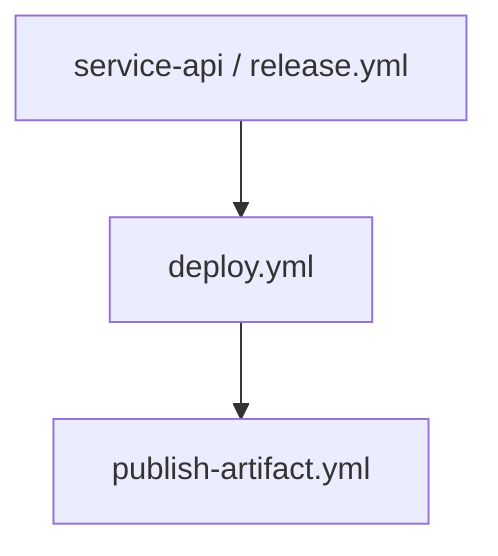

# Plan d'implémentation de l'audit des reusable workflows

> Pour réaliser l'audit avec l'outil livré, suivre le [guide opérationnel](guide-audit.md). Ce plan reste une référence de conception ; il n'est pas nécessaire d'implémenter ses scripts Bash ni d'en exécuter les exemples pour utiliser le moteur Python.

## Outil disponible dans ce dossier

Le [guide d'utilisation](README.md) décrit désormais un outil exécutable : [audit.py](audit.py), avec un point d'entrée Bash [audit.sh](audit.sh), une configuration JSON et les commandes `check`, `run`, `resume`, `report` et `demo`. Son moteur Python 3.11+ utilise le parseur YAML 1.2 `ruamel.yaml` ; les extraits Bash/curl/jq/yq ci-dessous restent la conception détaillée et des alternatives, pas les dépendances du moteur livré. Les résultats et checkpoints de la précédente version Node restent lisibles et reprenables.

La démonstration et les tests fonctionnent sans token ni accès à votre organisation. Consultez les limites documentées avant l'utilisation réelle : l'outil automatise le socle statique, mais pas tous les enrichissements facultatifs de ce plan. Aucun audit de votre organisation n'a été lancé.

Le moteur supporte également `"authMode": "user"` après `gh auth login`, sans GitHub App. Suivre le [guide opérationnel](guide-audit.md) pour ce mode ; les hypothèses et exemples App du plan ci-dessous restent la conception historique.

## Contexte confirmé avant les commandes

- Hébergement : **GitHub Enterprise Cloud**, API `https://api.github.com`.
- Authentification : **GitHub App, token d'installation**.
- Outils disponibles : Bash, curl, jq, gh CLI et git. L'environnement Bash exact reste à préciser (WSL, Git Bash ou Linux). Les exemples supposent Bash 5+, curl avec `--fail-with-body` et jq 1.6+.
- Analyse YAML : ajouter **yq v4 de Mike Farah**, non confirmé comme disponible. Ne pas remplacer par le paquet Python homonyme.
- Périmètre confirmé : **branches par défaut uniquement**, pour **tous** les repositories de l'organisation, publics, privés, internes, archivés et forks.
- Organisation et repository bibliothèque : noms non communiqués ; `acme` et `ci-workflows` sont des exemples à remplacer, pas des informations sur votre entreprise.
- Aucun audit n'est réalisé ici : ce document décrit les étapes et les scripts à implémenter, tester puis exécuter vous-même.

La couverture des **branches appelantes** et la résolution des **refs appelées** sont deux choses différentes : même si les appelants sont scannés uniquement sur leur branche par défaut, chaque `uses` doit être collecté et résolu quelle que soit sa ref (branche, tag ou SHA).

Les sections 27 à 34 complètent et fiabilisent la base initiale : inventaire indépendant, pagination, journalisation, versions des contrats, tests hors ligne et publication. Les scripts conceptuels des sections 8 et 11 sont des points de départ : appliquez les exigences de couverture des sections 27 à 31 avant leur utilisation à l'échelle de l'organisation.

## Objectif et périmètre

Construisez un audit **statique** des reusable workflows présents dans un repository « bibliothèque », puis recherchez leurs appels dans les workflows des repositories de l’organisation.

Exemple de cible :

- Organisation : `acme`
- Repository de workflows partagés : `acme/ci-workflows`
- Workflows à auditer : `acme/ci-workflows/.github/workflows/*.yml`
- Consommateurs : tous les repositories de `acme`, y compris archivés et forks, quelle que soit leur visibilité
- Références recherchées :

  ```yaml
  jobs:
    build:
      uses: acme/ci-workflows/.github/workflows/build.yml@v2
  ```

> **Important :** « référencé » ne signifie pas nécessairement « exécuté récemment ». Une référence statique peut être dans un workflow désactivé, conditionnel, jamais déclenché, ou situé sur une branche inactive. L’audit doit donc distinguer :
>
> - **référence statique détectée** ;
> - **référence potentiellement active** sur la branche par défaut ;
> - éventuellement **preuve d’exécution** à partir de l’historique des runs, si ce volet est ajouté.

Les reusable workflows sont appelés au niveau d’un **job** avec `jobs.<job_id>.uses`, et le workflow appelé doit déclarer `on.workflow_call`. Les entrées, secrets et outputs doivent être exposés explicitement dans ce bloc. Consultez [Reuse workflows](https://docs.github.com/en/actions/how-tos/reuse-automations/reuse-workflows).

---

## 1. Livrables recommandés

Prévoyez les artefacts suivants :

```text
workflow-audit/
├── README.md
├── config.env.example
├── scripts/
│   ├── 00-check-prerequisites.sh
│   ├── 01-list-repositories.sh
│   ├── 02-discover-library-workflows.sh
│   ├── 03-extract-workflow-contract.sh
│   ├── 04-scan-consumers.sh
│   ├── 05-generate-docs.sh
│   ├── 06-validate-report.sh
│   └── lib/
│       ├── github-api.sh
│       └── common.sh
├── data/
│   ├── repositories.jsonl
│   ├── reusable-workflows.json
│   ├── consumer-references.jsonl
│   └── audit.json
├── docs/
│   ├── index.md
│   └── workflows/
│       ├── build.md
│       ├── deploy.md
│       └── ...
├── templates/
│   └── workflow.md.tpl
└── reports/
    ├── audit.csv
    ├── audit.json
    ├── unresolved-references.csv
    └── security-observations.md
```

### Format de résultat minimal

Pour chaque reusable workflow, produisez :

| Champ                    | Exemple                                         |
| ------------------------ | ----------------------------------------------- |
| Identifiant              | `acme/ci-workflows/.github/workflows/build.yml` |
| Nom lisible              | `Build and test`                                |
| Chemin                   | `.github/workflows/build.yml`                   |
| Référence audité         | branche et SHA exacts                           |
| Fonction                 | compile, teste, publie, déploie, etc.           |
| Déclencheur réutilisable | `on.workflow_call`                              |
| Inputs                   | nom, type, required, default, description       |
| Secrets                  | nom, required, description                      |
| Outputs                  | nom, description, expression                    |
| Permissions              | workflow et jobs                                |
| Runners                  | `ubuntu-latest`, runner self-hosted, labels     |
| Jobs                     | dépendances, conditions, étapes majeures        |
| Actions appelées         | `actions/checkout@...`, etc.                    |
| Workflows imbriqués      | reusable workflows appelés depuis celui-ci      |
| Usages internes          | repositories/workflows appelants                |
| Référence consommée      | tag, branche ou SHA                             |
| Niveau de confiance      | exact, dynamique, à confirmer                   |
| Risques / observations   | SHA non figé, permissions larges, secrets, etc. |

---

## 2. Préparer l’environnement

## 2.1 Outils

Installez au minimum :

- `bash` 5+ ;
- `curl` ;
- `jq` 1.6+ ;
- `yq` v4 de Mike Farah ;
- `git` ;
- idéalement `parallel` ou `xargs -P` pour paralléliser ;
- facultatif : `gh`, `shellcheck`, `yamllint`.

Vérification :

```bash
bash --version
curl --version
jq --version
yq --version
git --version
```

### Attention à `yq`

Utilisez bien **yq v4 de Mike Farah** :

```bash
yq --version
# Attendu : yq (...) version v4.x.x
```

Ne mélangez pas cette syntaxe avec le paquet Python `yq`, dont le comportement et les options sont différents.

## 2.2 Variables de configuration

Créez `config.env` — à ne pas committer :

```bash
# GitHub.com
export GITHUB_API_URL="https://api.github.com"
export GITHUB_API_VERSION="2026-03-10"

# GitHub Enterprise Server : adaptez l'hôte et le chemin.
# export GITHUB_API_URL="https://github.entreprise.example/api/v3"

# Injecter GITHUB_TOKEN depuis votre gestionnaire de secrets, hors de ce fichier.
export ORG="acme"

# Repository contenant les reusable workflows.
export LIBRARY_REPO="ci-workflows"

# Inclure les repos archivés ?
export INCLUDE_ARCHIVED="true"

# Inclure les forks appartenant à l'organisation ?
export INCLUDE_FORKS="true"

# Nombre de téléchargements/scans en parallèle.
export PARALLELISM="6"
```

Puis :

```bash
chmod 600 config.env
source config.env
```

Ajoutez ces règles à `.gitignore` :

```gitignore
config.env
data/raw/
tmp/
.clones/
```

## 2.3 Token et permissions

### Mode retenu : GitHub App

Demandez à un propriétaire d'installer l'App dans l'organisation sur **All repositories**, et vérifiez que le token n'est pas restreint à une sous-liste. Les permissions de repository nécessaires au socle statique sont **Metadata: read** (implicitement disponible) et **Contents: read**. Il n'est pas nécessaire d'accorder `Workflows: write`, `Contents: write` ou un droit de modification des workflows.

Pour les enrichissements facultatifs : **Actions: read** pour workflows/runs ; **Administration: read** pour les endpoints de politiques Actions qui le demandent ; **Environments: read** pour les environnements. Vérifiez les permissions de chaque endpoint choisi avant d'étendre l'App. Les inventaires de noms de secrets nécessitent des permissions supplémentaires (`Secrets: read`, `Organization secrets: read`, selon le niveau) et ne font pas partie du socle.

Ne validez pas un token d'installation avec `GET /user` : utilisez `GET /installation/repositories`. Un token d'installation expire généralement après une heure ; prévoyez son renouvellement via un mécanisme approuvé, sans placer la clé privée de l'App dans les scripts ou ce document.

Si votre gestionnaire ne fournit pas déjà le token, faites générer localement un JWT d'App signé RS256 avec un SDK maintenu (durée maximale 10 minutes, horloge synchronisée). Le JWT est distinct du token d'installation. Exemple de création du token, sans afficher sa valeur :

```bash
set +x
umask 077
: "${APP_JWT:?JWT injecté par votre mécanisme approuvé}"
: "${INSTALLATION_ID:?Identifiant non secret de l'installation}"
token_response="$(curl --fail-with-body --silent --show-error \
  --request POST \
  --header 'Accept: application/vnd.github+json' \
  --header "Authorization: Bearer ${APP_JWT}" \
  --header 'X-GitHub-Api-Version: 2026-03-10' \
  --header 'Content-Type: application/json' \
  --data '{"permissions":{"contents":"read","metadata":"read"}}' \
  "https://api.github.com/app/installations/${INSTALLATION_ID}/access_tokens")"
export GITHUB_TOKEN="$(jq -er '.token' <<<"$token_response")"
export TOKEN_EXPIRES_AT="$(jq -er '.expires_at' <<<"$token_response")"
unset token_response APP_JWT
```

Ne transmettez ni `repositories` ni `repository_ids` pour réduire accidentellement le périmètre. La réponse contenant le token ne doit **jamais** être enregistrée dans les réponses brutes. Une installation sur tous les dépôts ne remplace pas le rapprochement d'inventaire décrit en section 27.

#### Alternatives si le mode change

| Mode             | Droits minimum du socle                                                                                       | Conditions de couverture                                                                                           |
| ---------------- | ------------------------------------------------------------------------------------------------------------- | ------------------------------------------------------------------------------------------------------------------ |
| PAT classique    | `repo` pour privés/internes ; `read:org` uniquement si des données organisationnelles choisies le nécessitent | Compte effectivement autorisé sur tous les dépôts, autorisation SAML SSO si requise, politiques d'entreprise       |
| PAT fine-grained | Resource owner = organisation, tous les repositories, `Contents: read` et `Metadata: read`                    | Approbation organisationnelle si requise, accès réel du titulaire, disponibilité du mode pour les dépôts concernés |
| GitHub App       | `Contents: read`, `Metadata: read`                                                                            | Installation sur tous les dépôts, permissions approuvées, token non restreint, installation non suspendue          |

Le scope classique `workflow` sert à écrire des workflows, pas à les lire. Aucun mode d'authentification ne donne magiquement accès aux dépôts hors de ses autorisations.

Le token doit pouvoir :

1. lire le repository de la bibliothèque de workflows ;
2. lister les repositories de l’organisation ;
3. lire les contenus et métadonnées des repositories à scanner ;
4. accéder aux repositories privés inclus dans le périmètre.

Pour un PAT classic, un cas courant est :

- `repo` pour accéder aux repositories privés ;
- `read:org` pour les données organisationnelles nécessaires selon votre configuration.

Ne stockez jamais le token dans les scripts, les logs, les commits, ni les rapports générés.

Si les reusable workflows sont stockés dans un repository privé et consommés par d’autres repositories privés de l’organisation, vérifiez que le repository est autorisé à partager ses workflows avec l’organisation. GitHub avertit qu’un tel partage donne aux runners un accès indirect au repository partagé, et qu’un token d’installation temporaire est utilisé pour télécharger les éléments partagés. [Sharing actions and workflows with your organization](https://docs.github.com/en/actions/how-tos/reuse-automations/share-with-your-organization)

---

## 3. Architecture du processus

Je recommande ce pipeline en six phases.

```text
1. Inventorier les repositories de l’organisation
                 │
2. Identifier les reusable workflows de la bibliothèque
                 │
3. Extraire leur contrat et leur comportement
                 │
4. Scanner les workflows consommateurs dans l’organisation
                 │
5. Corréler les références aux workflows documentés
                 │
6. Générer Markdown, JSON, CSV et observations de sécurité
```

### Phase 1 — Inventaire des repositories

Objectif :

- obtenir tous les repositories visibles avec votre token ;
- conserver les métadonnées utiles ;
- conserver et marquer archives et forks, sans les exclure ;
- récupérer la branche par défaut de chaque repository.

Métadonnées utiles :

```json
{
  "full_name": "acme/service-api",
  "name": "service-api",
  "private": true,
  "archived": false,
  "fork": false,
  "default_branch": "main",
  "visibility": "private",
  "html_url": "https://github.com/acme/service-api",
  "updated_at": "2026-09-18T12:34:56Z"
}
```

### Phase 2 — Découverte des reusable workflows

Dans `acme/ci-workflows`, cherchez les fichiers :

```text
.github/workflows/*.yml
.github/workflows/*.yaml
```

Puis conservez seulement ceux qui possèdent :

```yaml
on:
  workflow_call:
```

Ne supposez pas que tous les fichiers de `.github/workflows` sont réutilisables : certains seront déclenchés par `push`, `pull_request`, `schedule` ou `workflow_dispatch` sans être appelables par d’autres workflows.

### Phase 3 — Extraction du contrat

Pour chaque workflow réutilisable, extrayez :

- métadonnées globales : `name`, `on.workflow_call` ;
- `inputs` ;
- `secrets` ;
- `outputs` ;
- permissions déclarées ;
- jobs ;
- jobs appelant un autre reusable workflow ;
- actions utilisées dans les steps ;
- runners ;
- conditions `if` ;
- environnements ;
- concurrence ;
- références à `vars`, `secrets`, `github`, `inputs`, `needs`, etc.

### Phase 4 — Recherche des consommateurs

Scannez les workflows de chaque repository de l’organisation, a minima sur leur **branche par défaut**.

Ciblez :

```text
.github/workflows/*.yml
.github/workflows/*.yaml
```

Pour chaque fichier, recherchez notamment :

```yaml
uses: acme/ci-workflows/.github/workflows/<fichier>.yml@<ref>
```

Vous devez traiter les cas suivants :

```yaml
# Référence à un tag : préférable à une branche, mais mutable.
uses: acme/ci-workflows/.github/workflows/build.yml@v2

# Référence à une branche : mutable.
uses: acme/ci-workflows/.github/workflows/build.yml@main

# Référence à un SHA : reproductible et recommandée pour la sécurité.
uses: acme/ci-workflows/.github/workflows/build.yml@0123456789abcdef...

# Référence locale, possible seulement dans le même repository.
uses: ./.github/workflows/build.yml
```

### Phase 5 — Corrélation

Pour chaque appel détecté :

- identifier le workflow source ;
- identifier le repository et le fichier appelant ;
- identifier le job appelant ;
- extraire `with`, `secrets`, `permissions`, `if`, `needs`, `concurrency` ;
- comparer les inputs et secrets réellement fournis au contrat du workflow ;
- relever :
  - input obligatoire absent ;
  - secret requis absent ;
  - input inconnu ;
  - secret inconnu ;
  - référence à une version obsolète ;
  - branche mutable utilisée à la place d’un SHA ou d’un tag de version ;
  - workflow cible introuvable à la référence spécifiée.

### Phase 6 — Documentation et rapport

Générez :

- une page Markdown par reusable workflow ;
- un index ;
- un JSON complet, exploitable par d’autres outils ;
- un CSV synthétique ;
- une liste des références ambiguës ou non résolues ;
- une note de couverture indiquant exactement ce qui a été scanné.

---

## 4. Base Bash commune pour l’API GitHub

Créez `scripts/lib/github-api.sh` :

```bash
#!/usr/bin/env bash
set -euo pipefail

: "${GITHUB_API_URL:?GITHUB_API_URL est requis}"
: "${GITHUB_TOKEN:?GITHUB_TOKEN est requis}"
GITHUB_API_VERSION="${GITHUB_API_VERSION:-2026-03-10}"
umask 077
mkdir -p data/raw/http

header_value() {
  local name="$1" file="$2"
  awk -v name="$name" '
    tolower($0) ~ "^" tolower(name) ":" {
      sub(/^[^:]*:[[:space:]]*/, ""); sub(/\r$/, ""); value=$0
    }
    END { print value }
  ' "$file"
}

github_api() {
  local method="$1"
  local endpoint="$2"
  shift 2

  [[ "$method" == GET && "$endpoint" == /* ]] || return 2
  local attempt prefix code transport delay remaining reset retry_after message
  for attempt in 1 2 3 4; do
    prefix="$(mktemp data/raw/http/request.XXXXXX)"
    API_LAST_HEADERS="${prefix}.headers"
    transport=0
    code="$(curl --silent --show-error --connect-timeout 15 --max-time 120 \
      --request GET \
      --header 'Accept: application/vnd.github+json' \
      --header "Authorization: Bearer ${GITHUB_TOKEN}" \
      --header "X-GitHub-Api-Version: ${GITHUB_API_VERSION}" \
      --dump-header "$API_LAST_HEADERS" --output "${prefix}.body" \
      --write-out '%{http_code}' \
      "${GITHUB_API_URL}${endpoint}" "$@")" || transport=$?

    jq -nc --arg at "$(date -u +%FT%TZ)" --arg endpoint "$endpoint" \
      --arg status "$code" --arg request_id "$(header_value x-github-request-id "$API_LAST_HEADERS")" \
      --arg evidence "$prefix" --argjson transport "$transport" \
      '{at:$at,endpoint:$endpoint,http_status:$status,transport_exit:$transport,
        request_id:$request_id,evidence:$evidence}' >> data/requests.jsonl

    if [[ "$transport" == 0 && "$code" == 200 ]]; then
      cat "${prefix}.body"
      return 0
    fi

    delay=$((2 ** attempt + RANDOM % 3))
    retry_after="$(header_value retry-after "$API_LAST_HEADERS")"
    remaining="$(header_value x-ratelimit-remaining "$API_LAST_HEADERS")"
    reset="$(header_value x-ratelimit-reset "$API_LAST_HEADERS")"
    message="$(jq -r '.message // ""' "${prefix}.body" 2>/dev/null || true)"
    if [[ "$code" == 403 || "$code" == 429 ]]; then
      if [[ "$retry_after" =~ ^[0-9]+$ ]]; then
        delay=$((retry_after + 1))
      elif [[ "$remaining" == 0 && "$reset" =~ ^[0-9]+$ ]]; then
        delay=$((reset - $(date +%s) + 1))
        ((delay > 0)) || delay=1
      elif [[ "${message,,}" != *"secondary rate limit"* ]]; then
        printf 'Accès refusé : %s (%s)\n' "$endpoint" "$code" >&2
        return 1
      else
        delay=60
      fi
    elif [[ "$transport" != 0 ]]; then
      case "$transport" in 5|6|7|18|28|52|56) ;; *) return 1 ;; esac
    elif [[ ! "$code" =~ ^(500|502|503|504)$ ]]; then
      printf 'Échec API : %s (%s)\n' "$endpoint" "$code" >&2
      return 1
    fi
    ((attempt < 4 && delay <= 300)) || return 1
    sleep "$delay"
  done
  return 1
}

urlencode() {
  jq -rn --arg value "$1" '$value | @uri'
}

require_command() {
  command -v "$1" >/dev/null 2>&1 || {
    echo "Commande manquante : $1" >&2
    exit 1
  }
}

paginate() {
  local endpoint="$1" selector="$2" destination="$3"
  local page=1 separator='?' response next count temporary
  [[ "$endpoint" == *'?'* ]] && separator='&'
  temporary="$(mktemp "${destination}.XXXXXX")"
  while :; do
    response="$(mktemp data/raw/http/page.XXXXXX)"
    if ! github_api GET "${endpoint}${separator}per_page=100&page=${page}" > "$response"; then
      rm -f "$temporary"
      return 1
    fi
    if ! jq -e "${selector} | type == \"array\"" "$response" >/dev/null; then
      rm -f "$temporary"
      return 1
    fi
    jq -c "${selector}[]" "$response" >> "$temporary"
    next="$(header_value link "$API_LAST_HEADERS")"
    count="$(jq "${selector} | length" "$response")"
    [[ "$next" == *'rel="next"'* ]] || break
    ((count > 0)) || { rm -f "$temporary"; return 1; }
    page=$((page + 1))
  done
  mv "$temporary" "$destination"
}
```

Ce helper est limité aux **GET** du socle. Il conserve corps, en-têtes et statut HTTP, refuse les redirects automatiques et borne les retries. Un `401` nécessite un renouvellement approuvé du token ; un `403` de permission ou un `404` n'est pas réessayé aveuglément. Les attentes longues sont différées : conserver l'erreur puis reprendre ultérieurement. Les fichiers temporaires des réponses constituent des preuves privées, pas des livrables publics. Ne lancez pas plusieurs workers écrivant dans le même journal : un répertoire et un journal par worker, fusionnés ensuite.

`paginate` suit l'indication `rel="next"` de l'en-tête `Link`, reconstruit le numéro de page sur le même endpoint et publie atomiquement le JSONL seulement à la fin. Elle s'applique aux endpoints paginés par `page` utilisés ici, pas à ceux à curseur. Créez le répertoire de destination au préalable.

Utilisation :

```bash
source config.env
source scripts/lib/github-api.sh

github_api GET "/installation/repositories?per_page=1" |
  jq '{total_count, repository_selection}'
```

Ne faites pas de `set -x` dans un shell ayant `GITHUB_TOKEN` en variable : cela risquerait de l’afficher dans les logs.

---

## 5. Inventorier tous les repositories de l’organisation

Créez `scripts/01-list-repositories.sh` :

```bash
#!/usr/bin/env bash
set -euo pipefail

source config.env
source scripts/lib/github-api.sh

mkdir -p data

output="data/repositories.jsonl"
paginate "/orgs/$(urlencode "$ORG")/repos?type=all&sort=full_name&direction=asc" \
  '.' data/repositories-visible.jsonl
paginate '/installation/repositories' '.repositories' \
  data/repositories-installation.jsonl
jq -sc --arg org "$ORG" '
  unique_by(.id)[]
  | select((.owner.login | ascii_downcase) == ($org | ascii_downcase))
  | {id,name,full_name,private,visibility,archived,fork,default_branch,html_url,updated_at}
' data/repositories-visible.jsonl data/repositories-installation.jsonl > "$output"

echo "Repositories retenus : $(wc -l < "$output")" >&2
```

Exécution :

```bash
chmod +x scripts/01-list-repositories.sh
./scripts/01-list-repositories.sh

head -n 3 data/repositories.jsonl | jq .
```

L’endpoint employé est :

```bash
GET /orgs/{org}/repos
```

Exemple isolé :

```bash
curl --fail-with-body --silent --show-error --location \
  -H "Accept: application/vnd.github+json" \
  -H "Authorization: Bearer ${GITHUB_TOKEN}" \
  -H "X-GitHub-Api-Version: 2022-11-28" \
  "${GITHUB_API_URL}/orgs/${ORG}/repos?type=all&per_page=100&page=1" |
  jq -r '.[] | [.full_name, .default_branch, .archived, .fork] | @tsv'
```

---

## 6. Récupérer l’arbre Git d’un repository

Utiliser l’API Git Trees est plus efficace que télécharger tout le repository lorsqu’on veut uniquement identifier les fichiers de workflow.

Séquence :

1. obtenir la branche par défaut ;
2. récupérer son SHA de commit ;
3. récupérer le SHA de l’arbre ;
4. obtenir l’arbre récursivement ;
5. filtrer les workflows.

## 6.1 Exemple précis avec `curl`

```bash
OWNER="acme"
REPO="ci-workflows"

repo_json="$(
  github_api GET "/repos/${OWNER}/${REPO}"
)"

DEFAULT_BRANCH="$(jq -r '.default_branch' <<<"$repo_json")"

branch_json="$(
  github_api GET "/repos/${OWNER}/${REPO}/git/ref/heads/$(urlencode "$DEFAULT_BRANCH")"
)"

COMMIT_SHA="$(jq -r '.object.sha' <<<"$branch_json")"

commit_json="$(
  github_api GET "/repos/${OWNER}/${REPO}/git/commits/${COMMIT_SHA}"
)"

TREE_SHA="$(jq -r '.tree.sha' <<<"$commit_json")"

github_api GET \
  "/repos/${OWNER}/${REPO}/git/trees/${TREE_SHA}?recursive=1" |
  jq -r '
    .tree[]
    | select(.type == "blob")
    | select(.path | test("^\\.github/workflows/.*\\.(yml|yaml)$"; "i"))
    | .path
  '
```

Vous devez conserver le SHA audité dans vos résultats. C’est essentiel : la branche `main` peut changer entre deux étapes de l’audit.

---

## 7. Télécharger un workflow précisément

Pour récupérer le contenu brut d’un workflow :

```bash
OWNER="acme"
REPO="ci-workflows"
REF="main"
PATH_IN_REPO=".github/workflows/build.yml"

curl --fail-with-body --silent --show-error --location \
  -H "Accept: application/vnd.github.raw+json" \
  -H "Authorization: Bearer ${GITHUB_TOKEN}" \
  -H "X-GitHub-Api-Version: 2022-11-28" \
  "${GITHUB_API_URL}/repos/${OWNER}/${REPO}/contents/${PATH_IN_REPO}?ref=$(urlencode "${REF}")" \
  > /tmp/build.yml
```

Vérification :

```bash
sed -n '1,120p' /tmp/build.yml
```

Pour une reproductibilité maximale, remplacez `REF="main"` par le SHA de commit résolu lors de l’inventaire.

---

## 8. Découvrir les reusable workflows de la bibliothèque

Créez `scripts/02-discover-library-workflows.sh` :

```bash
#!/usr/bin/env bash
set -euo pipefail

source config.env
source scripts/lib/github-api.sh

mkdir -p data/raw/library

LIBRARY_OWNER="$ORG"
LIBRARY_FULL_NAME="${LIBRARY_OWNER}/${LIBRARY_REPO}"

repo_json="$(github_api GET "/repos/${LIBRARY_FULL_NAME}")"
default_branch="$(jq -r '.default_branch' <<<"$repo_json")"

ref_json="$(
  github_api GET \
    "/repos/${LIBRARY_FULL_NAME}/git/ref/heads/$(urlencode "$default_branch")"
)"

commit_sha="$(jq -r '.object.sha' <<<"$ref_json")"

commit_json="$(
  github_api GET "/repos/${LIBRARY_FULL_NAME}/git/commits/${commit_sha}"
)"

tree_sha="$(jq -r '.tree.sha' <<<"$commit_json")"

tree_json="$(
  github_api GET \
    "/repos/${LIBRARY_FULL_NAME}/git/trees/${tree_sha}?recursive=1"
)"

jq -r '
  .tree[]
  | select(.type == "blob")
  | select(.path | test("^\\.github/workflows/.*\\.(yml|yaml)$"; "i"))
  | .path
' <<<"$tree_json" |
while IFS= read -r workflow_path; do
  local_file="data/raw/library/$(basename "$workflow_path")"

  curl --fail-with-body --silent --show-error --location \
    -H "Accept: application/vnd.github.raw+json" \
    -H "Authorization: Bearer ${GITHUB_TOKEN}" \
    -H "X-GitHub-Api-Version: 2022-11-28" \
    "${GITHUB_API_URL}/repos/${LIBRARY_FULL_NAME}/contents/${workflow_path}?ref=${commit_sha}" \
    > "$local_file"

  if yq -o=json '.' "$local_file" |
    jq -e '(.on | type) == "object" and (.on | has("workflow_call"))' >/dev/null; then
    printf '%s\t%s\t%s\n' \
      "$workflow_path" \
      "$commit_sha" \
      "$local_file"
  fi
done > data/reusable-workflows.tsv

echo "Reusable workflows détectés :" >&2
column -t -s $'\t' data/reusable-workflows.tsv >&2
```

Exemple de sortie :

```text
.github/workflows/build.yml   5a8f...   data/raw/library/build.yml
.github/workflows/deploy.yml  5a8f...   data/raw/library/deploy.yml
```

---

## 9. Extraire le contrat d’un reusable workflow

## 9.1 Exemple de workflow à analyser

```yaml
name: Build and test

on:
  workflow_call:
    inputs:
      node-version:
        description: Version de Node.js à utiliser
        required: false
        type: string
        default: "22"
      run-e2e:
        description: Exécuter les tests end-to-end
        required: false
        type: boolean
        default: false
    secrets:
      NPM_TOKEN:
        description: Token pour les packages privés
        required: false
    outputs:
      artifact-name:
        description: Nom de l'artifact généré
        value: ${{ jobs.build.outputs.artifact-name }}

permissions:
  contents: read

jobs:
  build:
    runs-on: ubuntu-latest
    outputs:
      artifact-name: ${{ steps.metadata.outputs.artifact-name }}
    steps:
      - uses: actions/checkout@v4
      - uses: actions/setup-node@v4
        with:
          node-version: ${{ inputs.node-version }}
      - run: npm ci
      - run: npm test
```

## 9.2 Extraction des champs principaux

Convertissez d'abord chaque YAML en un document JSON, puis faites les transformations avec **jq**, pas avec le langage partiellement compatible de yq. Cette séparation évite les incompatibilités de fonctions (`map`, construction d'objets, etc.). Vérifiez un document unique et rejetez les clés dupliquées avec un validateur adapté ; une conversion réussie ne suffit pas à prouver la validité GitHub Actions.

```bash
WORKFLOW="data/raw/library/build.yml"

yq -o=json '.' "$WORKFLOW" | jq '{
  name: .name,
  workflow_call: ."on".workflow_call,
  permissions: (.permissions // null),
  concurrency: (.concurrency // null),
  defaults: (.defaults // null)
}'
```

### Inputs

```bash
yq -o=json '.' "$WORKFLOW" | jq '
  (."on".workflow_call.inputs // {})
  | to_entries
  | map({
      name: .key,
      description: (.value.description // null),
      type: (.value.type // null),
      required: (.value.required // false),
      default_declared: (.value | has("default")),
      default: (if (.value | has("default")) then .value.default else null end)
    })
'
```

#### Secrets

```bash
yq -o=json '.' "$WORKFLOW" | jq '
  (."on".workflow_call.secrets // {})
  | to_entries
  | map({
      name: .key,
      description: (.value.description // null),
      required: (.value.required // false)
    })
'
```

#### Outputs

```bash
yq -o=json '.' "$WORKFLOW" | jq '
  (."on".workflow_call.outputs // {})
  | to_entries
  | map({
      name: .key,
      description: (.value.description // null),
      value: (.value.value // null)
    })
'
```

#### Jobs, runners et permissions

```bash
yq -o=json '.' "$WORKFLOW" | jq '
  (.jobs // {})
  | to_entries
  | map({
      id: .key,
      name: (.value.name // .key),
      if: .value.if,
      needs: (.value.needs // []),
      runs_on: (.value."runs-on" // null),
      environment: (.value.environment // null),
      permissions: (.value.permissions // null),
      uses: (.value.uses // null),
      with: (.value.with // null),
      secrets: (.value.secrets // null),
      concurrency: (.value.concurrency // null)
    })
'
```

#### Actions utilisées dans les étapes

```bash
yq -o=json '.' "$WORKFLOW" | jq -r '
  .jobs
  | to_entries[]
  | .key as $job
  | (.value.steps // [])[]
  | select(.uses != null)
  | [$job, .uses]
  | @tsv
'
```

Exemple de sortie :

```text
build   actions/checkout@v4
build   actions/setup-node@v4
```

#### Workflows réutilisables imbriqués

```bash
yq -o=json '.' "$WORKFLOW" | jq -r '
  .jobs
  | to_entries[]
  | select(.value.uses != null)
  | [.key, .value.uses]
  | @tsv
'
```

Un reusable workflow peut en appeler un autre, dans la limite de la profondeur permise par GitHub. Documentez ces dépendances : elles sont importantes pour comprendre le comportement réel et les permissions effectives. [Reuse workflows](https://docs.github.com/en/actions/how-tos/reuse-automations/reuse-workflows)

---

## 10. Point YAML critique : la clé `on`

Évitez de parser les workflows avec certaines versions de PyYAML ou des outils YAML implémentant YAML 1.1 sans précaution : `on` peut être interprété comme le booléen `true`.

La syntaxe entre guillemets explicite la clé, mais **ne corrige pas** un parseur YAML 1.1 qui a déjà transformé `on` en booléen. Utilisez un parseur YAML 1.2 et vérifiez sa sortie JSON. Avec yq v4 :

```bash
yq '."on".workflow_call'
```

et non :

```bash
yq '.on.workflow_call'
```

De même, dans les rapports JSON, vérifiez explicitement que vous avez obtenu une clé `"on"` et non `"true"`.

---

## 11. Scanner les workflows consommateurs : méthode recommandée

### Méthode A — Scan exhaustif via Git Trees + téléchargement ciblé

C’est la méthode la plus fiable pour auditer la branche par défaut de tous les repositories.

Pour chaque repository :

1. récupérer la branche par défaut depuis `repositories.jsonl` ;
2. récupérer le commit et son arbre ;
3. filtrer les fichiers `.github/workflows/*.yml` et `.yaml` ;
4. télécharger uniquement ces fichiers ;
5. chercher les jobs avec `uses` ;
6. conserver le contexte du job appelant.

#### Pourquoi ne pas se limiter à une simple recherche textuelle ?

Un `grep` est utile mais insuffisant pour produire une documentation fiable :

- vous voulez connaître le **job** appelant ;
- vous voulez extraire `with`, `secrets`, `permissions`, `if` ;
- vous voulez détecter les appels à plusieurs niveaux ;
- vous voulez distinguer les actions ordinaires des reusable workflows ;
- vous voulez analyser les références locales.

Parsez **tous** les fichiers de workflow avec `yq` puis `jq`. Un préfiltre textuel peut servir de contrôle complémentaire, mais ne doit pas éliminer des fichiers avant le parsing (ancres YAML, aliases, chaînes échappées). Une erreur de parsing est une collecte partielle, jamais une absence de référence.

### Script de scan conceptuel

Créez `scripts/04-scan-consumers.sh` :

```bash
#!/usr/bin/env bash
set -euo pipefail

source config.env
source scripts/lib/github-api.sh

mkdir -p data/raw/consumers
: > data/consumer-references.jsonl

scan_workflow_file() {
  local repository="$1"
  local commit_sha="$2"
  local workflow_path="$3"
  local local_file="$4"

  curl --fail-with-body --silent --show-error --location \
    -H "Accept: application/vnd.github.raw+json" \
    -H "Authorization: Bearer ${GITHUB_TOKEN}" \
    -H "X-GitHub-Api-Version: 2022-11-28" \
    "${GITHUB_API_URL}/repos/${repository}/contents/${workflow_path}?ref=${commit_sha}" \
    > "$local_file"

  yq -o=json '.' "$local_file" | jq '
    (.jobs // {})
    | to_entries[]
    | select(.value.uses != null)
    | {
        job_id: .key,
        job_name: (.value.name // .key),
        reusable_reference: .value.uses,
        if: .value.if,
        needs: (.value.needs // []),
        permissions: (.value.permissions // null),
        with: (.value.with // null),
        secrets: (.value.secrets // null),
        concurrency: (.value.concurrency // null)
      }
  ' |
  jq -c \
    --arg repository "$repository" \
    --arg workflow_path "$workflow_path" \
    --arg commit_sha "$commit_sha" \
    --arg library_owner "$ORG" \
    --arg library_repo "$LIBRARY_REPO" '
      . as $job
      | {
          repository: $repository,
          caller_workflow_path: $workflow_path,
          caller_commit_sha: $commit_sha,
          job_id: $job.job_id,
          job_name: $job.job_name,
          reusable_reference: $job.reusable_reference,
          if: $job.if,
          needs: $job.needs,
          permissions: $job.permissions,
          with: $job.with,
          secrets: $job.secrets,
          concurrency: $job.concurrency,
          targets_library:
            (
              $job.reusable_reference
              | startswith($library_owner + "/" + $library_repo + "/.github/workflows/")
            )
        }
    ' >> data/consumer-references.jsonl
}

while IFS= read -r repo_json; do
  repository="$(jq -r '.full_name' <<<"$repo_json")"
  branch="$(jq -r '.default_branch' <<<"$repo_json")"

  echo "Scan : ${repository}@${branch}" >&2

  ref_json="$(
    github_api GET \
      "/repos/${repository}/git/ref/heads/$(urlencode "$branch")"
  )"

  commit_sha="$(jq -r '.object.sha' <<<"$ref_json")"

  commit_json="$(
    github_api GET "/repos/${repository}/git/commits/${commit_sha}"
  )"

  tree_sha="$(jq -r '.tree.sha' <<<"$commit_json")"

  tree_json="$(
    github_api GET \
      "/repos/${repository}/git/trees/${tree_sha}?recursive=1"
  )"

  while IFS= read -r workflow_path; do
    safe_repo="${repository//\//__}"
    safe_path="${workflow_path//\//__}"
    local_file="data/raw/consumers/${safe_repo}__${safe_path}"

    scan_workflow_file \
      "$repository" \
      "$commit_sha" \
      "$workflow_path" \
      "$local_file"
  done < <(
    jq -r '
      .tree[]
      | select(.type == "blob")
      | select(.path | test("^\\.github/workflows/.*\\.(yml|yaml)$"; "i"))
      | .path
    ' <<<"$tree_json"
  )

done < data/repositories.jsonl

jq -s '
  map(select(.targets_library == true))
' data/consumer-references.jsonl > data/consumer-references-library.json

echo "Références trouvées :" >&2
jq 'length' data/consumer-references-library.json >&2
```

Cette version est volontairement séquentielle pour être facile à comprendre. Ensuite, parallélisez avec prudence.

---

## 12. Recherche rapide complémentaire avec l’API Code Search

Utilisez la recherche de code uniquement comme **signal complémentaire**, pas comme vérité unique.

**Hors du socle retenu** : l'API REST Code Search nécessite une authentification utilisateur compatible et ne doit pas être supposée disponible avec le token d'installation GitHub App. Ne créez pas un PAT supplémentaire pour le socle ; les exemples de cette section ne sont à utiliser que si un accès distinct a été approuvé. L'indexation, la branche par défaut, les forks/archives, le plafond de 1 000 résultats et `incomplete_results` peuvent limiter la couverture. Paginer ne contourne pas ce plafond.

Exemple :

```bash
QUERY="acme/ci-workflows/.github/workflows/ org:acme path:.github/workflows"

curl --fail-with-body --silent --show-error --location \
  -H "Accept: application/vnd.github+json" \
  -H "Authorization: Bearer ${GITHUB_TOKEN}" \
  -H "X-GitHub-Api-Version: 2022-11-28" \
  --get \
  --data-urlencode "q=${QUERY}" \
  --data-urlencode "per_page=100" \
  "${GITHUB_API_URL}/search/code" |
  jq '{
    total_count,
    incomplete_results,
    items: [
      .items[] | {
        repository: .repository.full_name,
        path,
        html_url
      }
    ]
  }'
```

Pour un workflow spécifique :

```bash
WORKFLOW_FILE="build.yml"
QUERY="acme/ci-workflows/.github/workflows/${WORKFLOW_FILE} org:acme path:.github/workflows"
```

### Limites à documenter dans votre rapport

La recherche de code :

- peut être incomplète ;
- est limitée par pagination et quotas ;
- ne remplace pas le scan de tous les repositories autorisés ;
- peut ne pas couvrir les branches non indexées comme vous l’attendez ;
- ne résout pas les références construites dynamiquement ;
- fournit peu de contexte structurel sans téléchargement et parsing du fichier.

Dans votre rapport de couverture, indiquez par exemple :

```text
Méthode primaire : scan Git Trees de la branche par défaut de 184 repositories.
Méthode secondaire : GitHub Code Search, utilisée pour repérer des références
hors convention et contrôler les résultats.
Branches historiques : non incluses.
Tags : non inclus.
Repositories archivés : inclus, avec statut individuel de collecte.
Forks de l'organisation : inclus, sans suppression des doublons entre repositories.
```

---

## 13. Extraire et normaliser les références `uses`

Un appel externe typique :

```yaml
jobs:
  ci:
    uses: acme/ci-workflows/.github/workflows/build.yml@v2
```

Vous pouvez le découper ainsi :

```bash
REFERENCE="acme/ci-workflows/.github/workflows/build.yml@v2"

jq -n --arg value "$REFERENCE" '
  $value
  | capture(
      "^(?<owner>[^/]+)/(?<repo>[^/]+)/(?<path>\\.github/workflows/[^@]+)@(?<ref>.+)$"
    )
'
```

Résultat :

```json
{
  "owner": "acme",
  "repo": "ci-workflows",
  "path": ".github/workflows/build.yml",
  "ref": "v2"
}
```

Pour identifier des références faibles :

```bash
jq -r '
  .[]
  | select(.targets_library == true)
  | .reusable_reference
' data/consumer-references-library.json |
while IFS= read -r ref; do
  version="${ref##*@}"

  if [[ "$version" =~ ^[0-9a-f]{40}$ ]]; then
    echo "sha-commit  ${ref}"
  elif [[ "$version" =~ ^v?[0-9]+(\.[0-9]+){0,2}$ ]]; then
    echo "tag-version  ${ref}"
  else
    echo "mutable-or-ambiguous  ${ref}"
  fi
done
```

Interprétation :

| Référence                                     | Niveau                                         |
| --------------------------------------------- | ---------------------------------------------- |
| SHA de commit complet                         | reproductibilité élevée                        |
| tag de version                                | acceptable si le tag est protégé et immuable   |
| branche (`main`, `master`, `develop`)         | mutable, risque plus élevé                     |
| tag flottant (`v2`)                           | pratique mais mutable selon la gouvernance     |
| expression `${{ ... }}` dans `jobs.<id>.uses` | syntaxe invalide, à signaler ; ne pas résoudre |

---

## 14. Validation du contrat appelant / appelé

C’est une partie à très forte valeur ajoutée.

Pour chaque appel :

1. résolvez la ref appelée puis chargez le contrat **à son SHA exact**, pas celui de la branche par défaut de la bibliothèque (section 30) ;
2. listez les inputs requis ;
3. comparez-les aux clés de `jobs.<id>.with` ;
4. listez les secrets requis ;
5. comparez-les aux clés de `jobs.<id>.secrets` ;
6. vérifiez les inputs ou secrets inconnus ;
7. signalez les expressions impossibles à valider statiquement.

Exemple de workflow appelé :

```yaml
on:
  workflow_call:
    inputs:
      environment:
        type: string
        required: true
      image:
        type: string
        required: true
    secrets:
      DEPLOY_TOKEN:
        required: true
```

Exemple d’appel problématique :

```yaml
jobs:
  deploy:
    uses: acme/ci-workflows/.github/workflows/deploy.yml@v2
    with:
      environment: production
    secrets: inherit
```

Observations :

- `image` requis mais absent ;
- `secrets: inherit` signifie que la présence exacte de `DEPLOY_TOKEN` doit être vérifiée dans le contexte appelant ;
- la validation ne peut pas confirmer automatiquement que le secret existe, car l’API ne retourne jamais la valeur des secrets — et ne doit pas le faire.

Exemple de résultat JSON :

```json
{
  "repository": "acme/service-api",
  "caller_workflow_path": ".github/workflows/release.yml",
  "job_id": "deploy",
  "called_workflow": "acme/ci-workflows/.github/workflows/deploy.yml@v2",
  "validation": {
    "missing_required_inputs": ["image"],
    "missing_required_secrets": [],
    "unknown_inputs": [],
    "secrets_mode": "inherit",
    "status": "warning"
  }
}
```

---

## 15. Cas particuliers à traiter explicitement

## 15.1 `secrets: inherit`

```yaml
jobs:
  call:
    uses: acme/ci-workflows/.github/workflows/deploy.yml@v2
    secrets: inherit
```

Documentez :

- que le workflow reçoit les secrets du contexte appelant selon les règles GitHub ;
- que vous ne pouvez pas connaître leur valeur ;
- que l’existence exacte doit être vérifiée via la configuration du repository, de l’organisation ou de l’environnement si votre autorisation le permet ;
- que `inherit` complique la validation statique.

Les secrets utilisés dans les workflows doivent faire l’objet d’une attention particulière ; les logs masquent normalement les secrets, mais cela ne remplace pas une revue du workflow et des permissions disponibles. [Investigation tools for security incidents](https://docs.github.com/en/code-security/reference/security-incident-response/investigation-tools)

## 15.2 Expressions : distinguer `uses` et les valeurs d'appel

```yaml
uses: acme/ci-workflows/.github/workflows/${{ inputs.workflow }}.yml@v2
```

ou :

```yaml
with:
  version: ${{ github.sha }}
```

Le premier exemple est **invalide** : GitHub n'autorise pas les contexts ou expressions dans `jobs.<id>.uses`. Conservez-le comme référence candidate invalide pour revue, sans l'ignorer. Le second, dans `with`, est valide mais sa valeur et son type peuvent nécessiter une évaluation à l'exécution. Traitez uniquement ces valeurs d'appel comme :

```text
statut: dynamique / non résoluble statiquement
action: revue manuelle requise
```

## 15.3 Appels locaux

```yaml
uses: ./.github/workflows/release.yml
```

Ils ne sont pas des appels au repository bibliothèque externe, sauf lorsque vous analysez le repository bibliothèque lui-même. Ils méritent néanmoins d’être documentés dans le graphe de dépendances interne.

## 15.4 Workflows imbriqués

```text
service-api/release.yml
  └── ci-workflows/deploy.yml
        └── ci-workflows/publish-artifact.yml
```

Générez un graphe, au format Mermaid par exemple :



## 15.5 Appels via `workflow_dispatch`, `push`, `pull_request`

Ne confondez pas :

```yaml
on:
  workflow_dispatch:
```

avec :

```yaml
on:
  workflow_call:
```

Un workflow peut déclarer les deux. Dans ce cas, il est à la fois exécutable directement et réutilisable.

## 15.6 Permissions

Examinez :

```yaml
permissions:
  contents: read
  id-token: write
```

et les surcharges au niveau job :

```yaml
jobs:
  deploy:
    permissions:
      contents: read
      id-token: write
```

Points d’attention :

- `permissions: write-all` ;
- droits `contents: write`, `pull-requests: write`, `packages: write` ;
- `id-token: write`, qui indique souvent un usage OIDC ;
- absence de `permissions`, donc dépendance aux permissions par défaut du repository ou de l’organisation ;
- permissions du workflow appelant par rapport à celles du workflow appelé.

Les paramètres de permissions GitHub Actions peuvent être inspectés au niveau repository par API, notamment via les endpoints liés à `actions/permissions`, aux workflows autorisés et aux permissions par défaut. [REST API endpoints for GitHub Actions permissions](https://docs.github.com/en/rest/actions/permissions)

## 15.7 Environnements protégés

```yaml
environment:
  name: production
```

Consignez les environnements utilisés, car ils peuvent impliquer :

- approbations ;
- secrets et variables dédiés ;
- règles de déploiement ;
- restrictions de branches.

---

## 16. Audit de sécurité recommandé

Ajoutez une section par workflow intitulée **Observations de sécurité**.

### Checklist

- [ ] `permissions` est explicitement défini.
- [ ] Les permissions sont minimales.
- [ ] `id-token: write` est justifié.
- [ ] Les actions tierces sont épinglées par SHA, ou au minimum par version maîtrisée.
- [ ] Les reusable workflows appelés sont épinglés par SHA ou tag gouverné.
- [ ] Les branches mutables ne sont pas utilisées dans les déploiements sensibles.
- [ ] Les secrets requis sont documentés.
- [ ] `secrets: inherit` est justifié et limité.
- [ ] Les runners self-hosted sont identifiés.
- [ ] Les commandes shell n’exécutent pas sans précaution des données issues d’événements ou inputs.
- [ ] Les environnements de production ont les protections attendues.
- [ ] Les workflows consommateurs connaissent la version qu’ils consomment.
- [ ] Les outputs ne risquent pas de contenir des informations sensibles.

Exemples de règles de sévérité :

| Sévérité    | Exemple                                                                                |
| ----------- | -------------------------------------------------------------------------------------- |
| Critique    | déploiement production depuis une branche mutable avec permissions d’écriture étendues |
| Élevée      | action tierce non épinglée dans un workflow manipulant des secrets                     |
| Moyenne     | `secrets: inherit` sans justification ni contrat clair                                 |
| Faible      | description absente pour un input ou un secret                                         |
| Information | workflow inutilisé sur les branches par défaut scannées                                |

GitHub associe la facturation et l’allocation des runners au workflow appelant, pas au repository du workflow appelé. C’est une information utile pour attribuer les coûts et responsabilités de chaque consommateur. [Billing and usage](https://docs.github.com/en/actions/concepts/billing-and-usage)

---

## 17. Modèle Markdown par workflow

Créez `templates/workflow.md.tpl` :

````markdown
# {{NAME}}

- **Identifiant :** `{{OWNER}}/{{REPOSITORY}}/{{PATH}}`
- **Révision auditée :** `{{COMMIT_SHA}}`
- **Nom du workflow :** `{{NAME}}`
- **Réutilisable :** oui (`on.workflow_call`)
- **Dernière génération de cette documentation :** `{{GENERATED_AT}}`

## Objectif

{{PURPOSE}}

## Fonctionnement

{{BEHAVIOR_SUMMARY}}

## Déclencheurs

```yaml
{{TRIGGERS_YAML}}
```

## Contrat d’appel

### Inputs

| Nom | Type | Obligatoire | Défaut | Description |
|---|---:|:---:|---|---|
{{INPUTS_TABLE}}

### Secrets

| Nom | Obligatoire | Description |
|---|:---:|---|
{{SECRETS_TABLE}}

### Outputs

| Nom | Description | Valeur |
|---|---|---|
{{OUTPUTS_TABLE}}

## Permissions

```yaml
{{PERMISSIONS_YAML}}
```

## Jobs

{{JOBS_SECTION}}

## Actions et dépendances

| Job | Référence |
|---|---|
{{ACTIONS_TABLE}}

## Workflows réutilisables appelés

{{NESTED_WORKFLOWS_SECTION}}

## Runners et environnements

{{RUNNERS_AND_ENVIRONMENTS}}

## Utilisation dans l’organisation

| Repository appelant | Workflow appelant | Job | Référence consommée | Condition | Inputs | Secrets |
|---|---|---|---|---|---|---|
{{CONSUMERS_TABLE}}

## Validation du contrat

{{CONTRACT_VALIDATION_SECTION}}

## Observations de sécurité

{{SECURITY_OBSERVATIONS}}

## Limites de l’audit

- Analyse statique effectuée sur les branches par défaut ; autres branches appelantes, tags appelants et historique exclus.
- Repositories publics, privés, internes, archivés et forks inclus dans le périmètre ; accès et erreurs détaillés dans le rapport de couverture.
- Les refs appelées (branches, tags, SHA) sont résolues indépendamment du périmètre des branches appelantes.
- Les expressions dynamiques et `secrets: inherit` peuvent nécessiter une revue manuelle.
- Une référence détectée ne prouve pas qu’un workflow a été exécuté.
````

---

## 18. Exemple de page générée

Tous les noms, SHA et usages ci-dessous sont **fictifs**. La description doit refléter les étapes réellement lues : le workflow de la section 9 installe et teste, mais n'implémente ni publication d'artifact ni tests E2E. Ses paramètres `run-e2e` et `NPM_TOKEN` sont déclarés mais inutilisés, et son output référence une étape absente.

````markdown
# Build and test

- **Identifiant :** `acme/ci-workflows/.github/workflows/build.yml`
- **Révision auditée :** `5a8f02f41d...`
- **Réutilisable :** oui (`on.workflow_call`)

## Objectif

Installe les dépendances Node.js et exécute les tests unitaires.
Le paramètre `run-e2e` ne commande aucune étape dans la révision présentée.

## Contrat d’appel

### Inputs

| Nom | Type | Obligatoire | Défaut | Description |
|---|---:|:---:|---|---|
| `node-version` | string | non | `22` | Version Node.js utilisée |
| `run-e2e` | boolean | non | `false` | Exécute les tests end-to-end |

### Secrets

| Nom | Obligatoire | Description |
|---|:---:|---|
| `NPM_TOKEN` | non | Accès au registre npm privé |

## Permissions

```yaml
contents: read
```

## Utilisation dans l’organisation

| Repository appelant | Workflow appelant | Job | Référence consommée |
|---|---|---|---|
| `acme/service-api` | `.github/workflows/ci.yml` | `test` | `.../build.yml@v2` |
| `acme/web-app` | `.github/workflows/checks.yaml` | `quality` | `.../build.yml@main` |

## Observations de sécurité

- `acme/web-app` consomme une branche mutable (`main`) : préférer un SHA
  ou un tag de version gouverné.
- Les permissions sont explicitement réduites à `contents: read`.
````

---

## 19. Page d’index

Exemple `docs/index.md` :

Les chiffres qui suivent illustrent le format et ne constituent pas des résultats d'audit.

```markdown
# Catalogue des reusable workflows

| Workflow | Objectif | Inputs | Secrets | Consommateurs | Référence la plus utilisée |
|---|---|---:|---:|---:|---|
| [build.yml](workflows/build.md) | Build et tests | 2 | 1 | 18 | `v2` |
| [deploy.yml](workflows/deploy.md) | Déploiement | 4 | 3 | 7 | `v3` |
| [security-scan.yml](workflows/security-scan.md) | Analyse sécurité | 1 | 0 | 35 | `main` |

## Couverture de l’audit

- Repositories inventoriés : 184
- Repositories scannés : 176
- Repositories archivés : 6, inclus dans les 184 inventoriés
- Forks : 2, inclus dans les 184 inventoriés (catégories pouvant se chevaucher)
- Repositories partiels/inaccessibles : 8, voir le registre de couverture
- Workflows réutilisables détectés : 9
- Références détectées : 74
- Références dynamiques / manuelles : 3
- Date de génération : 2026-09-22
```

---

## 20. Produire un rapport CSV de gouvernance

Exemple de sortie :

```csv
called_workflow,consumer_repository,caller_workflow,caller_job,reference,reference_kind,validation_status
acme/ci-workflows/.github/workflows/build.yml,acme/service-api,.github/workflows/ci.yml,test,v2,tag,ok
acme/ci-workflows/.github/workflows/build.yml,acme/web-app,.github/workflows/checks.yml,quality,main,branch,warning
acme/ci-workflows/.github/workflows/deploy.yml,acme/catalog,.github/workflows/release.yml,deploy,0123456789abcdef0123456789abcdef01234567,sha,ok
```

Ce CSV permet de répondre rapidement à des questions telles que :

- Quels repositories utilisent `deploy.yml` ?
- Qui dépend encore de `v1` ?
- Qui référence `main` ?
- Quels workflows n’ont aucun consommateur ?
- Quels consommateurs n’envoient pas les inputs requis ?
- Quels workflows concentrent le plus de déploiements ou de dépendances ?

---

## 21. Contrôles de qualité du script

Ajoutez une validation avant publication.

```bash
# JSON syntaxiquement valide
jq empty data/audit.json

# Toutes les pages Markdown ont un titre
for file in docs/workflows/*.md; do
  head -n 1 "$file" | grep -q '^# ' || {
    echo "Titre manquant : $file"
    exit 1
  }
done

# Tous les workflows documentés ont une entrée dans l’index
while IFS=$'\t' read -r workflow_path _; do
  basename="${workflow_path##*/}"
  grep -q "$basename" docs/index.md || {
    echo "Workflow absent de l'index : $workflow_path"
    exit 1
  }
done < data/reusable-workflows.tsv
```

Et vérifiez les erreurs Bash :

```bash
shellcheck scripts/*.sh scripts/lib/*.sh
```

---

## 22. Performance, quotas et robustesse

### Recommandations

1. **Conservez les réponses brutes** afin d’éviter de répéter des appels durant le développement.
2. **Résolvez une fois les SHA** de branches ; n’utilisez pas `main` à chaque téléchargement.
3. **Parallélisez progressivement**, par exemple 4 à 8 téléchargements simultanés.
4. **Implémentez des retries** pour les erreurs transitoires `502`, `503`, `504` et les limites.
5. **Respectez les limites d’API** et inspectez les en-têtes :

   ```bash
   curl -I \
     -H "Authorization: Bearer ${GITHUB_TOKEN}" \
     "${GITHUB_API_URL}/rate_limit"
   ```

6. **Journalisez les erreurs par repository**, sans arrêter l’audit entier dès qu’un repository est inaccessible.
7. Produisez une liste explicite des repositories non scannés :

```json
{
  "repository": "acme/legacy-service",
  "status": "failed",
  "step": "download-workflow",
  "reason": "HTTP 403",
  "action": "Vérifier les permissions du token"
}
```

### Retry Bash minimal (illustration historique)

Le helper de section 4 gère déjà les retries bornés et respecte les en-têtes de quota. **Ne pas lui ajouter ce wrapper**, qui multiplierait les tentatives et ignorerait les erreurs permanentes ; l'extrait suivant montre seulement la logique simplifiée du plan initial.

```bash
github_api_retry() {
  local method="$1"
  local endpoint="$2"
  shift 2

  local attempt
  for attempt in 1 2 3 4; do
    if github_api "$method" "$endpoint" "$@"; then
      return 0
    fi

    sleep $((attempt * attempt))
  done

  return 1
}
```

---

## 23. Couverture avancée : branches, tags et historique

Le scan de la branche par défaut est le meilleur compromis initial, mais il ne couvre pas tout.

| Périmètre           | Valeur                     | Coût          |
| ------------------- | -------------------------- | ------------- |
| Branche par défaut  | usage actuellement visible | faible        |
| Branches de release | usages maintenus           | moyen         |
| Toutes les branches | couverture large           | élevé         |
| Tags                | versions publiées          | moyen à élevé |
| Historique Git      | usages anciens/supprimés   | très élevé    |

Plan conseillé :

1. **V1 retenue :** branche par défaut de tous les repositories, archives et forks inclus ;
2. **V2 :** branches `release/*`, `hotfix/*`, `develop` ;
3. **V3 :** tags de release sélectionnés ;
4. **V4 :** historique Git, uniquement pour une investigation ciblée.

Documentez toujours le périmètre réellement scanné. Ne dites pas « aucun consommateur » si vous avez seulement analysé les branches par défaut ; dites plutôt :

> Aucun appel n’a été détecté sur les branches par défaut des repositories inclus dans le périmètre au moment de l’audit.

---

## 24. Option : enrichir avec les exécutions réelles

Si vous devez distinguer les références actives des références réellement exécutées :

- récupérez les workflow runs des repositories consommateurs ;
- recherchez les runs récents ;
- conservez la date, le statut et l’URL de run ;
- ne récupérez les logs que dans un cadre justifié.

Les logs peuvent être téléchargés par API, mais GitHub indique qu’ils sont généralement conservés 90 jours par défaut, avec des limites configurables selon le type de repository et les politiques de l’organisation. [Investigation tools for security incidents](https://docs.github.com/en/code-security/reference/security-incident-response/investigation-tools)

Cette phase est facultative et distincte de l’audit statique, car elle ajoute :

- un coût API plus important ;
- une dépendance à la rétention ;
- des considérations de confidentialité et de sécurité ;
- une difficulté de corrélation entre un run appelant et un reusable workflow appelé.

---

## 25. Ordre d’implémentation conseillé

### Itération 1 — MVP fiable

1. Configurer l’authentification.
2. Lister les repositories de l’organisation.
3. Lister les fichiers de workflow du repository bibliothèque.
4. Identifier `on.workflow_call`.
5. Extraire `name`, `inputs`, `secrets`, `outputs`, `permissions`, `jobs`.
6. Générer une page Markdown par workflow.
7. Scanner les branches par défaut de tous les repositories.
8. Générer le tableau des consommateurs.

### Itération 2 — Validation du contrat

1. Comparer inputs/secrets requis et fournis, au SHA appelé.
2. Classer les références par SHA/tag/branche après résolution.
3. Détecter `secrets: inherit`.
4. Ajouter les observations de sécurité.
5. Produire JSON et CSV.

### Itération 3 — Gouvernance

1. Ajouter les branches de release uniquement si le périmètre confirmé est élargi.
2. Ajouter des graphiques de dépendances.
3. Ajouter des contrôles CI pour régénérer l’audit.
4. Ajouter un seuil d’échec, par exemple :
    - appels vers une branche interdite ;
    - secrets requis non documentés ;
    - workflow consommé sans version gouvernée ;
    - permissions `write-all`.

---

## 26. Critères d’acceptation

Votre implémentation est prête lorsque :

- [ ] tous les reusable workflows de la bibliothèque sont détectés ;
- [ ] chaque workflow a une page Markdown ;
- [ ] les inputs, secrets et outputs sont documentés ;
- [ ] les jobs, runners, permissions et actions utilisées sont listés ;
- [ ] tous les repositories inclus sont soit scannés, soit listés comme erreurs/exclus ;
- [ ] chaque référence détectée indique repository, workflow appelant, job et ref ;
- [ ] le rapport distingue branche, tag et SHA ;
- [ ] les usages `secrets: inherit`, valeurs d'appel dynamiques et syntaxes `uses` invalides sont explicitement marqués ;
- [ ] les résultats sont reproductibles à partir d’un SHA audité ;
- [ ] le rapport précise sa date et son périmètre ;
- [ ] aucun token ou contenu de secret n’est présent dans les rapports ou les logs.

Cette approche vous donne un audit exploitable à la fois comme **catalogue de workflows**, **inventaire de dépendances**, **base de migration de versions**, et **support de revue sécurité**.

---

## 27. Établir la couverture réelle de l'organisation

**Responsable :** propriétaire de l'organisation pour la liste de référence ; auditeur pour le rapprochement. **Sortie :** un registre de tous les dépôts attendus, y compris ceux non visibles au token.

- **Inventaire de référence :** obtenez du propriétaire un export complet à la date de l'audit : tableau JSON d'objets `{id, full_name, visibility, archived, fork}`. Incluez publics, privés, internes, archives et forks appartenant à l'organisation. Les forks appartenant à d'autres organisations ou utilisateurs sont hors périmètre.
- **Installation :** faites confirmer l'installation « All repositories », son organisation cible et l'absence de suspension. Si un JWT d'App est disponible via le mécanisme approuvé, collectez uniquement ses métadonnées (jamais le JWT) :

```bash
curl --fail-with-body --silent --show-error \
  -H 'Accept: application/vnd.github+json' \
  -H "Authorization: Bearer ${APP_JWT}" \
  -H "X-GitHub-Api-Version: ${GITHUB_API_VERSION}" \
  "${GITHUB_API_URL}/app/installations/${INSTALLATION_ID}" |
  jq '{id,account:{login:.account.login,id:.account.id},repository_selection,
       permissions,suspended_at}' > data/installation-metadata.json
```

- **Inventaire visible :** exécutez l'inventaire de la section 5. Comparez le nombre dédupliqué de l'installation au `total_count` conservé dans ses réponses paginées ; une variation pendant la collecte impose une nouvelle collecte d'inventaire. `repository_selection: all` est une preuve de configuration, pas une preuve de lecture réussie de chaque fichier.
- **Rapprochement :** comparez la liste indépendante (`data/repositories-expected.json`) à la liste visible, en conservant explicitement l'ID de l'objet courant lors de la comparaison :

```bash
jq -n --slurpfile expected data/repositories-expected.json \
  --slurpfile visible data/repositories.jsonl '
  ($visible | map(.id)) as $ids
  | $expected[0] | map(. as $repo | . + {
      discovery_status: (if ($ids | index($repo.id)) != null
        then "visible" else "not_visible_to_token" end)
    })
' > data/inventory-comparison.json
```

- **Dérive :** ajoutez également les dépôts visibles absents de l'export comme `inventory_drift`, à faire valider (création, renommage ou transfert récent). L'identifiant numérique évite les erreurs liées aux renommages.
- **Accès manquants :** pour un dépôt attendu non visible, tentez `GET /repos/{owner}/{repo}` avec le helper, puis consignez son statut. Un `404` peut cacher un dépôt privé inaccessible ; il ne prouve ni sa suppression ni l'absence de références.

```bash
if github_api GET '/repos/acme/legacy-service' > data/legacy-metadata.json; then
  jq '{id,full_name,default_branch,visibility,archived,fork}' data/legacy-metadata.json
else
  jq -nc '{repository:"acme/legacy-service",scan_status:"inaccessible",
    reference_count:null,reason:"Metadata request failed; see HTTP evidence"}' \
    >> data/coverage.jsonl
fi
```

Sans inventaire indépendant, ne prétendez pas connaître les noms ni le nombre des dépôts invisibles. Écrivez `organization_inventory_verified: false`, `unknown_repository_count: null` et « couverture limitée aux dépôts visibles ; exhaustivité organisationnelle non vérifiée ». N'annoncez jamais « 100 % de l'organisation » sur cette seule base.

## 28. Organiser les preuves et rendre la collecte reprenable

Complétez l'arborescence de la section 1, sans multiplier les formats concurrents :

```text
data/
  run-manifest.json                  # configuration non secrète et versions des outils
  repositories-expected.json         # tableau validé par le propriétaire
  repositories-visible.jsonl         # réponse organisation, normalisée ensuite
  repositories-installation.jsonl    # dépôts visibles à l'installation
  repositories.jsonl                 # union dédupliquée par repository ID
  coverage.jsonl                     # un état final par dépôt attendu/visible
  snapshots.jsonl                    # repository ID, branche, commit SHA, tree SHA, date
  files.jsonl                        # chemin, commit SHA, blob SHA, état téléchargement/parsing
  workflows.json                     # catalogue : un objet par chemin, versions sous ce chemin
  consumer-references.jsonl           # appels avec provenance ; directs ou transitifs
  resolutions.jsonl                  # owner/repo/path/ref -> commit SHA et état
  validations.jsonl                  # contrôle par appel et par version exacte
  requests.jsonl                     # journal HTTP sans authorization/token
  raw/http/                          # corps/en-têtes privés du helper
  raw/repos/<repository-id>/<commit-sha>/  # YAML et JSON parsés
reports/
  coverage.md
  inaccessible-repositories.csv
  unresolved-references.csv
  validation-findings.csv
```

**Unité d'identité :** workflow logique = owner/repo/chemin ; version = repository ID + chemin + SHA de commit ; appel = repository ID appelant + commit SHA appelant + chemin appelant + job ID. Deux forks identiques restent deux consommateurs distincts. Un tag et une branche résolus au même SHA partagent le contrat mais conservent leur texte `uses` distinct.

Produisez un manifeste au démarrage :

```bash
jq -n --arg started_at "$(date -u +%FT%TZ)" --arg api "$GITHUB_API_URL" \
  --arg org "$ORG" --arg library "$ORG/$LIBRARY_REPO" \
  --arg bash "$BASH_VERSION" --arg curl "$(curl --version | head -n 1)" \
  --arg jq "$(jq --version)" --arg yq "$(yq --version)" \
  '{schema_version:1,started_at:$started_at,api:$api,organization:$org,
    library:$library,auth_mode:"github_app_installation",caller_scope:"default_branch",
    include_archived:true,include_forks:true,
    visibility_scope:["public","private","internal"],
    tools:{bash:$bash,curl:$curl,jq:$jq,yq:$yq}}' > data/run-manifest.json
```

Ajoutez à la fin `finished_at`, le numéro de version/commit des scripts et la preuve de validation d'inventaire. La collecte n'est pas un snapshot atomique de toute l'organisation : chaque dépôt/ref a son propre instant de résolution.

Conservez les fichiers sous leur chemin original, dans un répertoire par ID et SHA. Écrivez d'abord dans un fichier temporaire, puis renommez-le uniquement après succès HTTP et parsing. Reprendre = retraiter les états non terminés à SHA identique, pas relire silencieusement la nouvelle tête de `main`. Un nouvel audit utilise un nouveau répertoire de run, sans écraser l'ancien.

## 29. Fiabiliser la découverte et le scan de chaque snapshot

**Hypothèse à tester :** la liste Git complète du snapshot contient tous les workflows directement sous `.github/workflows/`. Le scan des sections 6, 8 et 11 ne doit pas être considéré complet tant que `truncated` n'est pas faux et que chaque fichier a été téléchargé puis parsé.

### Arbres volumineux : parcours non récursif ciblé

Au lieu de charger l'arbre entier, traversez racine → `.github` → `workflows`. Exemple à mettre dans le helper commun ; `repository` et `commit_sha` sont déjà figés par la section 6 :

```bash
list_workflow_blobs() {
  local repository="$1" commit_sha="$2" tree_json tree_sha segment
  tree_json="$(github_api GET "/repos/${repository}/git/commits/${commit_sha}")" || return 1
  tree_sha="$(jq -er '.tree.sha' <<<"$tree_json")" || return 1
  for segment in .github workflows; do
    tree_json="$(github_api GET "/repos/${repository}/git/trees/${tree_sha}")" || return 1
    jq -e '.truncated == false' <<<"$tree_json" >/dev/null || return 1
    tree_sha="$(jq -r --arg segment "$segment" '
      [.tree[] | select(.path == $segment and .type == "tree")][0].sha // empty
    ' <<<"$tree_json")"
    [[ -n "$tree_sha" ]] || return 0
  done
  tree_json="$(github_api GET "/repos/${repository}/git/trees/${tree_sha}")" || return 1
  jq -e '.truncated == false' <<<"$tree_json" >/dev/null || return 1
  jq -c '.tree[] | select(.path | test("^[^/]+\\.(yml|yaml)$"))
    | {path:(".github/workflows/" + .path),sha,type,mode}' <<<"$tree_json"
}

if list_workflow_blobs "$repository" "$commit_sha" > data/workflow-blobs.tmp; then
  mv data/workflow-blobs.tmp data/workflow-blobs.jsonl
else
  printf '%s\n' 'Arbre incomplet : ne pas conclure à zéro référence.' >&2
fi
```

Un dossier absent dans un arbre **complet** signifie « aucun workflow dans ce snapshot ». Une erreur HTTP ou une troncature signifie `partial`. Si même le sous-arbre ciblé est tronqué, faites un fetch Git approuvé puis `git ls-tree` au SHA figé, ou marquez la collecte partielle ; il n'existe pas de pagination de Git Trees pour récupérer une tranche manquante. Les sous-dossiers de workflows ne sont pas pris en charge par GitHub ; les variantes d'extension/casse non standard restent des fichiers candidats à examiner, pas des workflows actifs présumés.

### Téléchargement, analyse et preuve d'intégrité

Téléchargez les fichiers par blob SHA pour éviter les problèmes d'encodage de chemin et d'ambiguïté de ref. Le mode `120000` est un lien symbolique, pas du YAML à parser automatiquement.

```bash
: "${repository:?}" "${commit_sha:?}" "${blob_sha:?}"
mkdir -p data/raw/blobs
blob_file="data/raw/blobs/${blob_sha}.yml"
if github_api GET "/repos/${repository}/git/blobs/${blob_sha}" \
  -H 'Accept: application/vnd.github.raw+json' > "${blob_file}.tmp"; then
  if [[ "$(git hash-object "${blob_file}.tmp")" == "$blob_sha" ]]; then
    mv "${blob_file}.tmp" "$blob_file"
    yq -o=json '.' "$blob_file" | jq -s -e '
      length == 1 and (.[0] | type == "object")
    ' >/dev/null
  else
    printf '%s\n' 'Blob incohérent : collecte partielle.' >&2
  fi
fi
```

Ne publiez pas `complete` si la commande de parsing échoue. Adaptez la vérification du hash si le repository annonce un algorithme Git autre que SHA-1 ; ne confondez pas le SHA de blob avec le SHA de commit.

### Orchestration finale du scanner

Extrayez le corps du scan de la section 11 dans un script `scan-one-repository.sh`, exécuté comme **processus séparé** avec `set -euo pipefail`. Ne mettez pas ce corps dans une fonction appelée dans `if` en supposant qu'`errexit` restera actif : Bash peut le désactiver dans ce contexte. Contrôlez explicitement chaque échec et écrivez les états de fichiers. Le coordinateur doit continuer après un dépôt inaccessible.

```bash
while IFS= read -r repo_json; do
  repository_id="$(jq -er '.id' <<<"$repo_json")"
  worker_dir="data/workers/${repository_id}"
  mkdir -p "$worker_dir"
  if bash scripts/scan-one-repository.sh "$repo_json" "$worker_dir"; then
    printf 'Terminé : %s\n' "$repository_id" >&2
  elif [[ ! -f "$worker_dir/coverage.json" ]]; then
    jq -nc --argjson id "$repository_id" \
      '{repository_id:$id,scan_status:"partial",reference_count:null,
        reason:"Worker failed; inspect its evidence"}' > "$worker_dir/coverage.json"
  fi
done < data/repositories.jsonl
```

Contrat du worker : produire ses journaux et résultats uniquement dans `worker_dir`, tenter tous les fichiers lisibles, garder les références déjà trouvées, retourner un code non nul s'il reste un échec, et produire `coverage.json` avec `expected_files`, `downloaded_files`, `parsed_files`, `caller_commit_sha`, `started_at`, `finished_at`. Pour distinguer `inaccessible` de `partial`, laissez le worker écrire son diagnostic précis et ne le remplacez pas par le fallback si ce fichier existe déjà. Le helper de section 4 utilise des chemins relatifs : exécutez chaque worker dans son espace de travail isolé, ou rendez son répertoire de données configurable.

En séquentiel, agrégez les JSONL à la fin ; pour paralléliser ensuite, utilisez des processus distincts et des sorties séparées. N'additionnez pas une valeur `null` comme zéro. Statuts finaux : `complete`, `no_workflows` (arbre complet, liste vide), `empty` (dépôt sans commit confirmé), `partial`, `inaccessible`, `not_visible_to_token`. Un YAML invalide donne `partial` même si les autres fichiers ont été analysés.

## 30. Résoudre chaque version réellement consommée

La classification par ressemblance à `v2` en section 13 est un **indice lexical**, pas une preuve de tag. Une branche peut s'appeler `v2`. Conservez tous les appels, même si le workflow a été supprimé ou renommé sur la branche par défaut de la bibliothèque.

### Algorithme de résolution

1. Parser `jobs.<job_id>.uses` après conversion YAML → JSON ; garder le texte original et les champs owner/repo/path/ref. Normaliser la casse **uniquement** pour comparer owner et repo ; garder la casse du chemin et de la ref. Ne pas filtrer les refs avec une convention de version.
2. Ref SHA complète : vérifier qu'elle désigne un commit ; ne pas accepter simplement une chaîne hexadécimale.
3. Sinon, interroger d'abord la ref **exacte** `tags/<ref>` ; en cas de tag annoté, suivre `/git/tags/{sha}` jusqu'au commit avec détection de cycle et limite défensive. Ne pas confondre SHA de l'objet tag et SHA du commit.
4. En l'absence vérifiée du tag, interroger `heads/<ref>`. Quand tag et branche portent le même nom, **le tag gagne**. Un `403`, une limite ou une erreur réseau lors de la recherche du tag ne permet pas de choisir la branche à sa place.
5. Charger le fichier au SHA résolu, vérifier la présence de `workflow_call` (même vide), puis extraire son contrat. Mettre en cache la résolution par `(repository ID, ref)` durant le run et le contrat par `(repository ID, path, commit SHA)`.

Exemples API distincts à intégrer dans votre résolveur :

```bash
target_repo="${ORG}/${LIBRARY_REPO}"
target_ref='release/2026.09'
encoded_ref="$(urlencode "$target_ref")"
github_api GET "/repos/${target_repo}/git/ref/tags/${encoded_ref}" > data/tag-ref.json
# Uniquement si .object.type == "tag" : répéter jusqu'à type "commit".
tag_object_sha="$(jq -er '.object.sha' data/tag-ref.json)"
github_api GET "/repos/${target_repo}/git/tags/${tag_object_sha}" > data/tag-object.json
# Alternative seulement après absence du tag établie :
github_api GET "/repos/${target_repo}/git/ref/heads/${encoded_ref}" > data/branch-ref.json
# Vérification finale : resolved_sha est le commit, jamais l'objet tag.
github_api GET "/repos/${target_repo}/git/commits/${resolved_sha}" > data/resolved-commit.json
```

Cet extrait montre les endpoints, **pas une séquence à lancer sans conditions** : un tag léger a déjà `.object.type == "commit"`, et une erreur de lecture reste une résolution inconnue. En section 7, utilisez ce SHA dans `ref=` pour récupérer le fichier cible, ou la méthode blob de section 29 après traversée de son arbre. Un `404` reste `unresolved` tant que l'accès au repository et au snapshot n'est pas confirmé.

### Filtrer les appels à la bibliothèque sans faux négatif de casse

```bash
jq -nc --arg use 'Acme/CI-Workflows/.github/workflows/build.yaml@release/2026.09' \
  --arg org "$ORG" --arg repo "$LIBRARY_REPO" '
  ($use | capture("^(?<owner>[^/]+)/(?<repo>[^/]+)/(?<path>\\.github/workflows/[^/@]+\\.(yml|yaml))@(?<ref>.+)$")) as $target
  | $target + {raw_uses:$use,targets_library:
      (($target.owner | ascii_downcase) == ($org | ascii_downcase)
       and ($target.repo | ascii_downcase) == ($repo | ascii_downcase))}
'
```

Avant ce parsing, détectez toute expression `${{ ... }}` dans `uses` comme `invalid_uses_expression`. Pour les chaînes mal formées, utilisez `try ... catch` avec un enregistrement `invalid_syntax` contenant la valeur d'origine ; ne les faites pas disparaître. Les commandes shell/commentaires mentionnant une chaîne `uses` ne sont pas des appels.

### Appels locaux et dépendances transitives

Les syntaxes locales `./.github/workflows/build.yml` et `$/...` (Enterprise Cloud, selon la syntaxe actuellement documentée) se résolvent au **commit du workflow appelant**. Pas de `@ref` local. Les appels locaux dans la bibliothèque constituent des dépendances internes ; ceux des autres dépôts ne ciblent pas la bibliothèque externe.

Construisez un graphe dont les nœuds portent repository/chemin/SHA. Descendez dans les workflows appelés à leurs versions résolues, y compris à l'extérieur de la bibliothèque si autorisé, afin de détecter A → wrapper → bibliothèque. Marquez séparément `direct` et `transitive`, avec toute la chaîne de provenance. Ne comptez pas un wrapper interne comme un nouveau repository consommateur externe. Si un wrapper externe est inaccessible, indiquez `dependency_graph_partial` et ne concluez pas qu'il n'appelle pas la bibliothèque. Appliquez la profondeur documentée par GitHub au moment de l'audit et détectez les cycles, sans inventer les nœuds manquants.

## 31. Valider le contrat et interpréter le comportement

**Sortie :** une validation par appel et par version exacte, puis une description humaine sourcée. La lecture des déclarations seule ne permet pas de savoir à quoi sert réellement le workflow.

Pour chaque workflow/version, lire les commandes `run`, les actions, scripts locaux et actions composites effectivement invoqués. Collectez ces dépendances au commit approprié avec la commande Contents de section 7 en adaptant le chemin. Un `checkout` dans un reusable workflow récupère généralement le repository appelant : un script local peut donc appartenir au consommateur, pas à la bibliothèque. Inspectez `repository`, `ref`, `path`, le répertoire de travail et les conditions du checkout avant d'attribuer la provenance.

Décrivez l'ordre via `needs`, conditions, matrices, stratégies, containers/services, shell/defaults, timeouts, retries implémentés, artifacts, caches, environnements, effets externes et outputs. Gardez une distinction entre intention (nom/description), comportement constaté dans le code et hypothèse à confirmer. N'exécutez aucun workflow, script collecté ni action pendant l'audit statique.

### Règles de comparaison

- Inputs obligatoires absents : finding certain pour le contrat à la version consommée ; inputs inconnus : finding certain.
- Defaults : préserver `false`, `0` et `""`, distinguer valeur explicite et défaut implicite GitHub (`false`, `0`, `""` selon le type). `jq` considère `false` comme absent avec `//` : ne pas l'utiliser pour remplacer un default booléen par `null`.
- Types littéraux : vérifier `string`, `boolean`, `number` ; `"false"` est une chaîne, pas un booléen. Les expressions et matrices nécessitent une analyse de leur provenance, ou `not_statically_verifiable`, pas un « type OK » inventé.
- Secrets nommés : comparer les **clés** du mapping, pas des valeurs sensibles. Une clé fournie ne prouve pas que le secret source existe ni soit disponible à l'exécution. `secrets: inherit` donne `availability_unknown`, pas une liste vide de secrets manquants présentée comme validation complète.
- `GITHUB_TOKEN` est automatiquement fourni dans le contexte pris en charge ; ne le traiter pas comme un secret obligatoire que l'appelant doit déclarer. Les secrets hérités peuvent être utilisés sans déclaration dans `workflow_call`.
- Les secrets d'environnement du job appelé peuvent remplacer les secrets passés ; l'héritage ne transmet pas automatiquement les secrets à tous les niveaux d'une chaîne.
- Outputs : vérifier la chaîne workflow → job → step, noms de steps/jobs existants, et conditions de production. Ne pas garantir une valeur qui dépend d'un run ou d'une matrice.
- Permissions : distinguer celles déclarées, celles héritées et celles effectives inconnues ; elles ne peuvent pas être augmentées à travers la chaîne. Ne pas confondre les permissions de l'App d'audit et celles de `GITHUB_TOKEN` dans les workflows.

Exemple de comparaison locale avec le JSON normalisé `called-contract.json` et `caller-job.json` :

```bash
jq -n --slurpfile called data/called-contract.json --slurpfile caller data/caller-job.json '
  ($called[0].workflow_call.inputs // {}) as $inputs
  | ($caller[0].with // {}) as $with
  | {missing_required_inputs:
      [$inputs | to_entries[] | select(.value.required == true)
       | .key as $name | select(($with | has($name)) | not) | $name],
     unknown_inputs: [($with | keys[]) as $name
       | select(($inputs | has($name)) | not) | $name],
     secrets_status: (if $caller[0].secrets == "inherit"
       then "availability_unknown" else "named_mapping_to_check" end)}
' > data/contract-check.json
```

### Enrichissements facultatifs, distincts du socle

Pour qualifier un workflow désactivé ou les politiques Actions, collectez les métadonnées suivantes si les permissions supplémentaires ont été approuvées. Paginer `.workflows` pour la première commande ; joindre par chemin, pas par nom lisible.

```bash
paginate "/repos/${repository}/actions/workflows" '.workflows' data/actions-workflows.jsonl
github_api GET "/repos/${repository}/actions/permissions" > data/actions-permissions.json
github_api GET "/repos/${repository}/actions/permissions/workflow" > data/token-defaults.json
github_api GET "/repos/${repository}/actions/permissions/access" > data/sharing-policy.json
paginate "/repos/${repository}/environments" '.environments' data/environments.jsonl
```

L'endpoint `actions/permissions/access` ne s'applique pas à tous les types de dépôt ; marquez `not_applicable` ou `unknown` après vérification, pas une erreur de contenu workflow. Ne collectez pas les valeurs de secrets ou variables. Les règles d'organisation/entreprise peuvent imposer des restrictions supplémentaires ; une lecture repository seule n'en prouve pas la totalité.

Si une preuve d'exécution est demandée plus tard (hors objectif actuel), collectez les runs avec une fenêtre définie et pagination, sans télécharger les logs :

```bash
paginate "/repos/${repository}/actions/runs?created=%3E%3D2026-09-01" \
  '.workflow_runs' data/runs.jsonl
jq -c '{id,path,head_sha,event,status,conclusion,created_at,html_url,
        referenced_workflows}' data/runs.jsonl > data/run-evidence.jsonl
```

Partitionnez la fenêtre si l'endpoint impose un plafond de résultats, et documentez rétention/absence de `referenced_workflows`. Un run du fichier appelant ne prouve pas que chaque job conditionnel a appelé sa cible ; une preuve absente n'est pas une preuve de non-exécution. Ne déduisez pas « actif » du seul fait d'être sur la branche par défaut, particulièrement pour archives et Actions désactivées.

## 32. Générer les pages Markdown et les rapports

Le modèle de section 17 est le gabarit principal. Ajoutez à chaque page : lien source immuable au SHA complet, statut de revue humaine, variantes de contrat par version consommée, inputs inutilisés, chaînes transitives, inconnues de permission/secrets et renvoi au rapport de couverture. Une page par **chemin**, et non par basename sans extension : `build.yml.md` et `build.yaml.md` ne doivent pas se remplacer. Les variantes supprimées de la branche par défaut restent documentées avec leur statut.

Les tableaux de consommateurs doivent inclure : repository, visibilité, archived/fork, chemin/job appelant, SHA appelant et URL de preuve, texte `uses`, type de ref prouvé, SHA appelé, usage direct/transitif, statut de validation. Comptez séparément repositories uniques, fichiers appelants et sites d'appel. Publiez « aucun appel détecté dans les snapshots complètement scannés », jamais « inutilisé dans l'organisation » en cas de couverture incomplète.

### Automatiser la génération sans exécuter les contenus collectés

Créez les objets de `data/workflows.json` avec `id`, `path`, `name`, `commit_sha`, `purpose`, `inputs` (tableau extrait en section 9) et `versions` (contrats par SHA). Les résumés humains validés sont des champs éditoriaux séparés ; une régénération ne doit pas les écraser. Voici un exemple de génération de l'index et d'une section inputs :

```bash
mkdir -p docs/workflows
jq -r '
  def cell: tostring | gsub("&"; "&amp;") | gsub("<"; "&lt;")
    | gsub(">"; "&gt;") | gsub("\\|"; "&#124;")
    | gsub("`"; "&#96;") | gsub("\\r?\\n"; "<br>");
  "# Catalogue des reusable workflows\n",
  "| Workflow | Objectif | Révision |",
  "| --- | --- | --- |",
  (.[] | "| " + (.path | cell) + " | " + (.purpose | cell)
    + " | " + (.commit_sha | cell) + " |")
' data/workflows.json > docs/index.md

jq -r '
  def cell: tostring | gsub("&"; "&amp;") | gsub("<"; "&lt;")
    | gsub(">"; "&gt;") | gsub("\\|"; "&#124;")
    | gsub("`"; "&#96;") | gsub("\\r?\\n"; "<br>");
  "| Nom | Type | Obligatoire | Défaut déclaré | Description |",
  "| --- | --- | --- | --- | --- |",
  (.inputs[] | "| " + ([.name,.type,.required,
    (if .default_declared then (.default | tojson) else "implicite" end),
    (.description // "Non documenté")] | map(cell) | join(" | ")) + " |")
' data/workflow-build.json > docs/workflows/build.yml.inputs.md
```

Ce dernier fichier est une section intermédiaire à intégrer au gabarit, pas une page finale supplémentaire. Dans le générateur final, construisez les liens d'index depuis le chemin encodé et vérifiez qu'ils pointent vers les pages générées. Ne faites pas `eval`, `source` ou substitution shell avec des données collectées. Échappez aussi les caractères Markdown `[]` et les backslashes dans les cellules du générateur final ; encodez les segments des liens avec `jq @uri`.

### Deuxième exemple concret : `docs/workflows/deploy.yml.md`

Exemple entièrement fictif, distinct du workflow Node.js précédent ; remplacer toutes les valeurs par les données et preuves réelles avant publication.

````markdown
# Deploy container

- Identifiant : `acme/ci-workflows/.github/workflows/deploy.yml`
- Version analysée : `0123456789abcdef0123456789abcdef01234567` (SHA fictif)
- Revue : à valider par le propriétaire du workflow

## Objectif et fonctionnement

Déploie l'image fournie vers la cible choisie après le job de préparation.
Les commandes de déploiement, runners et protections restent à renseigner depuis le code.
Cette intention n'est pas encore une conclusion vérifiée.

## Contrat

| Input | Type | Obligatoire | Défaut | Description |
| --- | --- | --- | --- | --- |
| environment | string | oui | non déclaré | Cible du déploiement |
| image | string | oui | non déclaré | Image à déployer |

| Secret | Obligatoire | Disponibilité |
| --- | --- | --- |
| DEPLOY_TOKEN | oui | Inconnue statiquement si hérité |

Outputs : aucun déclaré dans cet exemple.
Permissions, runners, environnements et dépendances : à vérifier au SHA indiqué.

## Exemple d'appel

```yaml
jobs:
  deploy:
    uses: acme/ci-workflows/.github/workflows/deploy.yml@v2
    with:
      environment: production
      image: registry.example/app:2026.09
    secrets:
      DEPLOY_TOKEN: ${{ secrets.DEPLOY_TOKEN }}
```

## Consommateurs et validation

| Repository | Workflow/job | Ref | Validation |
| --- | --- | --- | --- |
| acme/catalog | .github/workflows/release.yml / deploy | v2 | image absent dans l'appel observé fictif |

L'exemple d'appel complet ci-dessus n'est pas le même que l'appel incomplet observé.
Les autres versions consommées doivent avoir leur propre contrat et SHA dans cette page.

## Couverture et limites

Branches par défaut uniquement, archives et forks inclus dans le périmètre.
Voir [couverture](../../reports/coverage.md) pour les dépôts inaccessibles et fichiers invalides.
Les refs appelées sont résolues séparément. Une référence ne prouve pas une exécution.
````

Produisez le CSV avec `jq @csv` plutôt que par concaténation (virgules et retours à la ligne possibles). Exemple sur les appels résolus :

```bash
jq -sr '
  ["repository","workflow","job","raw_uses","caller_sha","target_sha","status"],
  (.[] | [.repository,.caller_workflow_path,.job_id,.reusable_reference,
          .caller_commit_sha,.target_commit_sha,.resolution_status]) | @csv
' data/consumer-references.jsonl > reports/audit.csv
```

## 33. Vérifier l'exactitude avant publication

### Tests locaux avec fixtures, avant tout accès à l'organisation

Implémentez les cas suivants dans un répertoire de tests existant, ou `tests/fixtures` de votre futur outil. Exécutez les fonctions de parsing et le client HTTP sur des réponses simulées, sans token réel.

| Cas                                                              | Résultat attendu                                      |
| ---------------------------------------------------------------- | ----------------------------------------------------- |
| `on: {workflow_call: null}` ; forme multilignes vide             | réutilisable détecté                                  |
| `on: [push, workflow_call]`                                      | réutilisable détecté, contrat vide                    |
| `workflow_call` absent ; `on: push`                              | non réutilisable                                      |
| Defaults `false`, `0`, `""`                                      | valeurs préservées, différentes de non déclaré        |
| `.yml` et `.yaml`, aliases/ancres                                | tous les appels structurels extraits                  |
| Bibliothèque avec casse owner/repo différente, ref contenant `/` | correspondance conservée, chemin/ref inchangés        |
| `uses` dans un commentaire, `run` ou une step                    | pas un appel réutilisable de job                      |
| Expression dans `uses`                                           | anomalie de syntaxe, conservée pour revue             |
| Tag léger, annoté, nom partagé tag/branche, SHA                  | SHA exact prouvé, priorité tag                        |
| Contrat `v1` différent de `main`                                 | validation contre `v1`, pas `main`                    |
| Cible supprimée sur `main` mais présente à l'ancien SHA          | version encore documentée                             |
| Pagination 0, 100, 101, 200 dépôts                               | aucun dépôt omis, toutes les pages conservées         |
| Dépôt privé/interne, archive, fork                               | aucun filtrage, provenance individuelle               |
| Dépôt attendu invisible ; YAML invalide ; HTTP 404               | statut inconnu/partiel, jamais zéro référence certain |
| Arbre récursif tronqué                                           | fallback ciblé ou statut partiel                      |
| 401 ; 403 permission ; 403/429 quota ; 503 ; timeout             | renouvellement/refus/retry borné approprié            |
| Appel local dans bibliothèque, appel transitive, cycle           | graphe versionné correct et cycle signalé             |
| Markdown avec pipe/backticks/nouvelle ligne                      | pas de tableau cassé ni contenu exécuté               |

Pour couvrir les formes `on` scalaires et tableaux en plus du mapping, remplacez le prédicat de section 8 par celui-ci dans la version finale :

```bash
printf '%s\n' '{"on":{"workflow_call":null}}' | jq -e '
  .on | if type == "object" then has("workflow_call")
  elif type == "array" then index("workflow_call") != null
  elif type == "string" then . == "workflow_call"
  else false end
'
printf '%s\n' '{"default":false}' |
  jq -e 'has("default") and .default == false'
```

Pour les déclencheurs scalaires/tableaux, normalisez un contrat vide avant extraction des inputs. Vérifiez explicitement YAML 1.2 avec `yq` :

```bash
printf 'on:\n  workflow_call:\n' | yq -o=json '.' |
  jq -e 'has("on") and (.on | has("workflow_call"))'
# Vérifier tous les scripts individuellement :
for script in scripts/*.sh scripts/lib/*.sh; do bash -n "$script"; done
# Optionnel si installé :
shellcheck scripts/*.sh scripts/lib/*.sh
```

### Rapprochements de données réelles

1. Vérifier les IDs dédupliqués contre l'export propriétaire ; comparer début et fin d'inventaire pour relever la dérive. Dénominateur inconnu = taux organisationnel non calculable.
2. Garantir un état de couverture par dépôt attendu/visible, et un état par fichier candidat. `complete` implique arbre complet + tous les fichiers téléchargés et parsés.
3. Vérifier les SHA de blobs, les SHA appelants et les SHA appelés ainsi que les liens immuables. Pour un échantillon stratifié (visibilités, archive/fork, tag/branche/SHA), relire manuellement le YAML via l'interface et une récupération indépendante au même SHA.
4. Rapprocher counts de dépôts, workflows, sites d'appel, versions et pages documentées ; ne pas additionner des catégories chevauchantes (un fork peut être privé et archivé).
5. Contrôler les inputs/secrets/outputs et les anomalies au contrat exact. Vérifier au minimum les findings certains et tous les cas non résolus avec le propriétaire.
6. Faire relire l'objectif et les effets externes par un mainteneur ; enregistrer reviewer/date/statut séparément des champs auto-générés.
7. Régénérer deux fois à partir des mêmes données brutes (hors horodatages) : les résultats doivent être identiques. Tester les liens et le rendu Markdown, notamment les blocs YAML imbriqués dans les modèles.

Exemple de contrôle d'invariant sur le registre final :

```bash
jq -se '
  all(.[]; .scan_status != "complete" or
    (.expected_files == .downloaded_files and
     .downloaded_files == .parsed_files and .tree_complete == true))
' data/coverage.jsonl
jq -e 'type == "array" and all(.[]; .id != null and .path != null)' data/workflows.json
```

## 34. Erreurs, publication et ordre final d'implémentation

| Situation                                             | Traitement                                                                                           | Impact sur le rapport                                  |
| ----------------------------------------------------- | ---------------------------------------------------------------------------------------------------- | ------------------------------------------------------ |
| 401/token expiré                                      | Renouveler via le fournisseur approuvé, une tentative de reprise au même SHA                         | Interruption d'authentification, pas « dépôt vide »    |
| 403 sans quota                                        | Vérifier App, politiques réseau/IP, approbation et permissions                                       | `inaccessible` ou `partial` selon l'étape              |
| 403/429 quota                                         | Lire Retry-After, remaining/reset, backoff borné ; reprise différée si attente longue                | Collecte incomplète jusqu'à reprise                    |
| 404                                                   | Vérifier métadonnées, accès et objet ; masquage des dépôts privés possible                           | `unresolved`/`inaccessible`, jamais zéro automatique   |
| 409/dépôt sans commit                                 | Confirmer le dépôt vide avec le propriétaire ou les métadonnées Git                                  | `empty` seulement si confirmé                          |
| 301/302/307                                           | Examiner Location sans transmettre le token à un hôte non validé ; garder repository ID/nom original | Renommage/transfert, dérive à expliquer                |
| TLS/proxy/certificat                                  | Utiliser le CA/proxy approuvé, ne pas désactiver TLS avec `-k`                                       | Échec transport, périmètre non vérifié                 |
| 500/502/503/504, timeout                              | Retry borné, journal et reprise                                                                      | `partial` si épuisement                                |
| YAML invalide/clé dupliquée/document multiple         | Garder le fichier, anomalie et éventuelles références textuelles candidates                          | Parsing incomplet, pas absence de références           |
| Fork miroir/archivé/Actions désactivées               | Scanner quand même, annoter son état                                                                 | Référence statique, activité non prouvée               |
| Ref mutable déplacée pendant le run                   | Conserver la première résolution ; noter changement si détecté                                       | Snapshot reproductible, pas preuve de l'ancien runtime |
| Version/path absent au SHA ou dépendance inaccessible | Garder la référence et les preuves partielles                                                        | Contrat/comportement non vérifié                       |

**Ordre final à suivre :**

1. Valider contexte et configuration non secrète (section 2), récupérer inventaire propriétaire et installation (27).
2. Implémenter helper API/pagination (4), stockage et manifeste (28), puis tester le client sur fixtures (33).
3. Collecter inventaire complet visible (5), rapprocher les attendus (27) et journaliser les accès manquants.
4. Figer bibliothèque et dépôts appelants (6), découvrir les fichiers et vérifier intégrité/parsing (7, 8, 29).
5. Extraire contrats et comportement sourcé de la bibliothèque (9, 31), puis les appels de tous les dépôts (11, 29).
6. Résoudre chaque ref et parcourir les dépendances imbriquées (13, 30) ; ajouter les workflows historiques encore référencés.
7. Valider chaque appel contre son contrat versionné (14, 15, 31). Les enrichissements permissions/runs restent facultatifs et explicitement autorisés.
8. Générer gabarits, pages par chemin et par variantes, index, CSV et couverture (17 à 20, 32), puis appliquer les tests et revue humaine (21, 33).
9. Publier uniquement les données approuvées, avec couverture et limites ; conserver les preuves privées selon la politique interne. Régénérer à la fréquence convenue ou lors de changements des workflows partagés, sans lancer de workflows audités.

**Critères supplémentaires obligatoires :** tous les dépôts attendus ont un statut ; archives/forks/visibilités ne sont jamais filtrés ; toutes les refs textuelles sont conservées ; les refs prouvées ont un SHA exact ; toute validation emploie le contrat de cette version ; les défauts faux/vides sont fidèles ; une couverture incomplète ne permet aucune conclusion globale d'inutilisation.

Dans `reports/coverage.md`, donner : scope confirmé, dates de collecte, preuve ou absence de preuve d'inventaire complet, totaux attendus/visibles/complètement scannés/partiels/inaccessibles, listes par dépôt et raisons, fichiers invalides, dépendances non résolues et exclusions de branches appelantes. État des versions appelées distinct de celui des dépôts appelants.

**Confidentialité :** les sources peuvent contenir des credentials codés en dur et des données internes, même sans consulter l'API des secrets. Les corps HTTP, YAML et valeurs `with` restent privés ; publier les noms, contrats et provenance après revue/redaction, pas les valeurs sensibles. Aucun `set -x`, aucun token dans URL, aucune archive de réponse de création de token, aucune clé privée dans Git, aucun log de contenu secret. Une sortie Markdown doit être relue avant diffusion dans un repository plus largement accessible.

**Sources officielles à revalider au moment de l'exécution :**

- [Réutilisation, syntaxe, inputs/secrets et priorité tag/branche](https://docs.github.com/en/actions/how-tos/reuse-automations/reuse-workflows)
- [Authentification d'installation GitHub App](https://docs.github.com/en/apps/creating-github-apps/authenticating-with-a-github-app/authenticating-as-a-github-app-installation)
- [Création d'un token et métadonnées d'installation](https://docs.github.com/en/rest/apps/apps)
- [Repositories accessibles à l'installation](https://docs.github.com/en/rest/apps/installations#list-repositories-accessible-to-the-app-installation)
- [Inventaire organisationnel](https://docs.github.com/en/rest/repos/repos#list-organization-repositories)
- [Pagination REST](https://docs.github.com/en/rest/using-the-rest-api/using-pagination-in-the-rest-api)
- [Limites REST et limites secondaires](https://docs.github.com/en/rest/using-the-rest-api/rate-limits-for-the-rest-api)
- [Git Trees, troncature et parcours non récursif](https://docs.github.com/en/rest/git/trees#get-a-tree)
- [Git Blobs](https://docs.github.com/en/rest/git/blobs#get-a-blob)
- [Références Git](https://docs.github.com/en/rest/git/refs#get-a-reference)
- [Tags annotés](https://docs.github.com/en/rest/git/tags#get-a-tag)
- [Permissions des endpoints GitHub Actions](https://docs.github.com/en/rest/actions/permissions)
